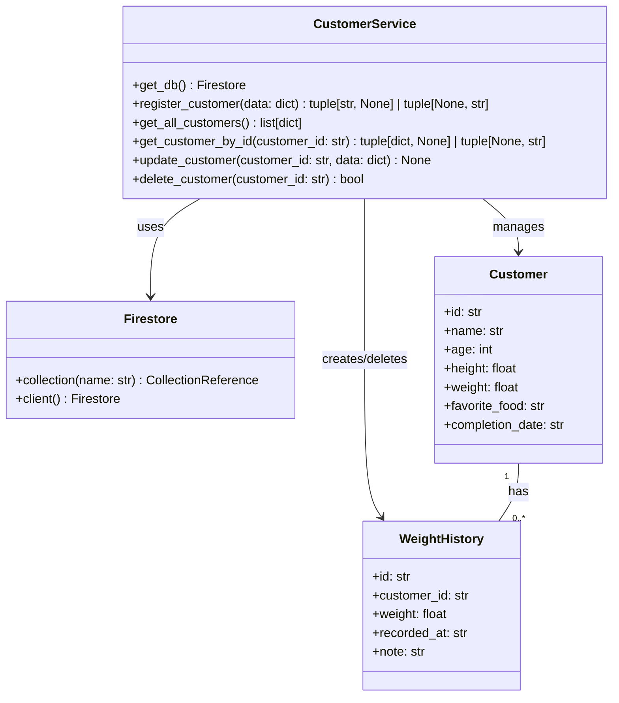
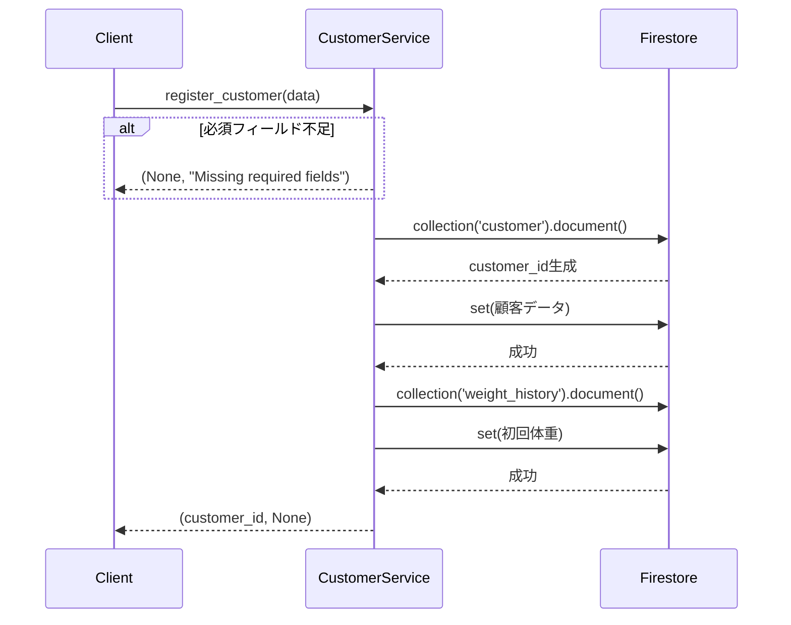
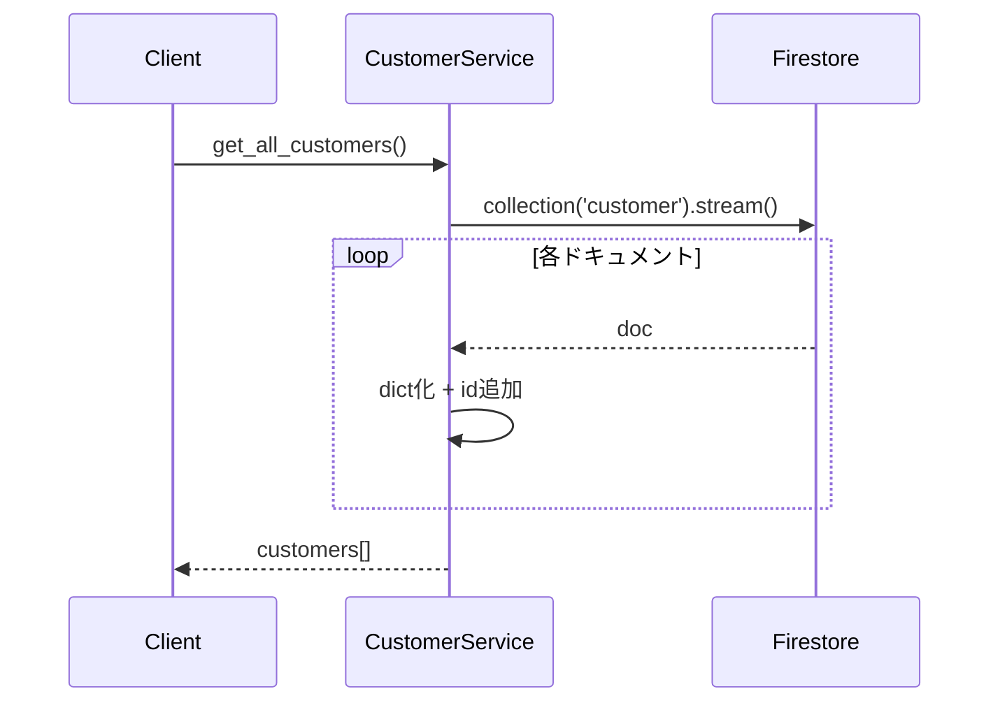
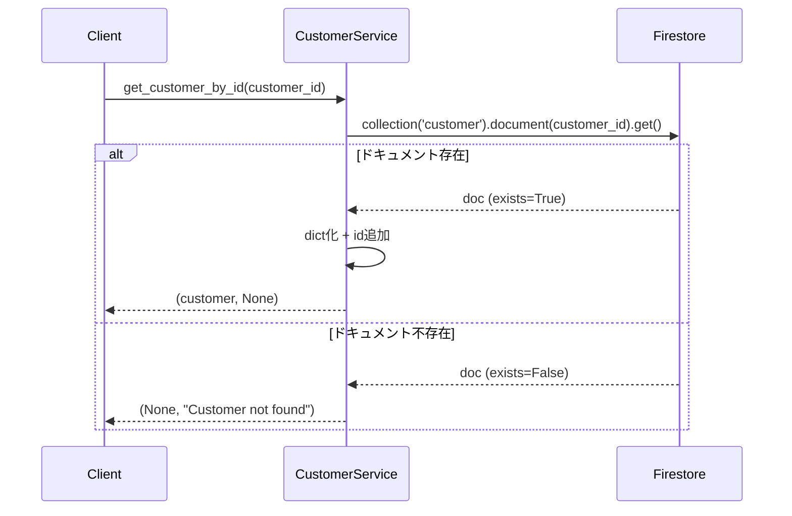
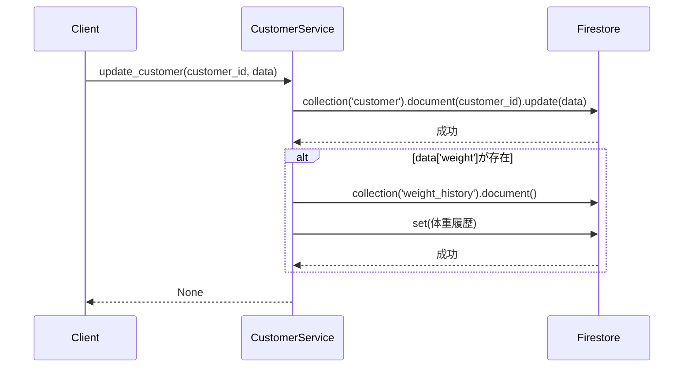
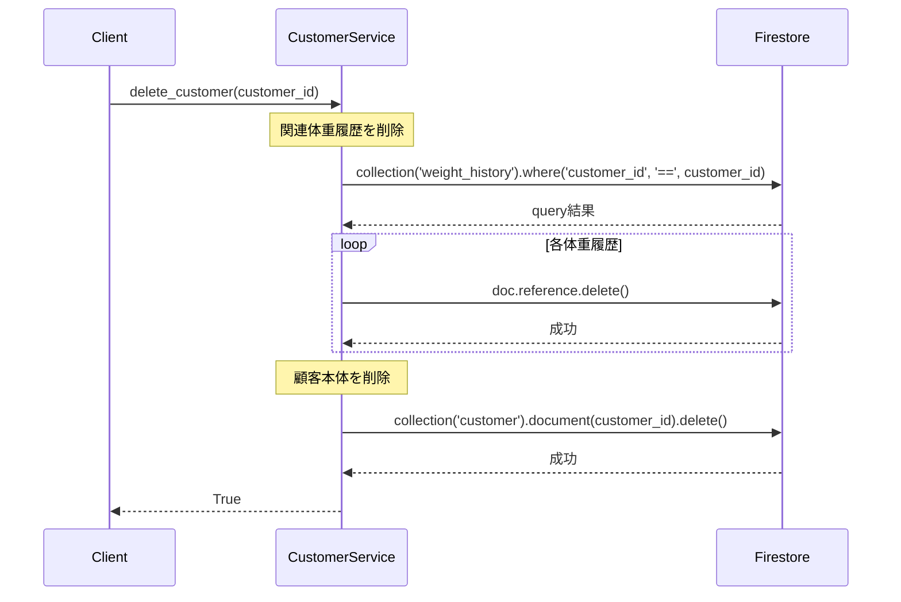

# 詳細設計書: CustomerService（顧客管理サービス）

**作成日**: 2026年1月4日  
**バージョン**: 1.0  
**担当**: MICHELAバックエンド

---

## 1. 概要

### 1.1 目的
フィットネスジムの顧客情報を管理し、登録・取得・更新・削除のCRUD操作を提供する。

### 1.2 責務
- 顧客の基本情報管理（氏名、年齢、身長、体重、好きな食べ物、完了予定日）
- 初回登録時の体重履歴自動作成
- 体重更新時の履歴追跡
- 顧客削除時の関連データカスケード削除

---

## 2. クラス図



---

## 3. データモデル

### 3.1 Customer（顧客）

| フィールド | 型 | 必須 | 説明 | 例 |
|-----------|-----|------|------|-----|
| id | string | ○ | 自動生成ID | "abc123xyz" |
| name | string | ○ | 氏名 | "山田太郎" |
| age | integer | ○ | 年齢 | 25 |
| height | float | ○ | 身長（cm） | 175.5 |
| weight | float | ○ | 体重（kg） | 70.0 |
| favorite_food | string | ○ | 好きな食べ物 | "鶏胸肉" |
| completion_date | string | ○ | 完了予定日（ISO 8601） | "2026-06-30" |

**Firestoreパス**: `customer/{customer_id}`

### 3.2 WeightHistory（体重履歴）

| フィールド | 型 | 必須 | 説明 |
|-----------|-----|------|------|
| id | string | ○ | 自動生成ID |
| customer_id | string | ○ | 顧客ID参照 |
| weight | float | ○ | 体重（kg） |
| recorded_at | string | ○ | 記録日時（ISO 8601） |
| note | string | ○ | メモ |

**Firestoreパス**: `weight_history/{record_id}`

---

## 4. メソッド仕様

### 4.1 register_customer(data: dict)

**目的**: 新規顧客を登録し、初回体重履歴を自動作成

**入力パラメータ**:
```python
{
    "name": str,           # 氏名
    "age": int,            # 年齢
    "height": float,       # 身長（cm）
    "weight": float,       # 体重（kg）
    "favorite_food": str,  # 好きな食べ物
    "completion_date": str # 完了予定日（YYYY-MM-DD）
}
```

**返り値**:
- 成功: `(customer_id: str, None)`
- 失敗: `(None, error_message: str)`

**処理フロー**:


**エラーハンドリング**:
- 必須フィールド欠如: `Missing required fields`
- Firestore書き込みエラー: Exception詳細を返却

**副作用**:
- `customer`コレクションに新規ドキュメント作成
- `weight_history`コレクションに初回記録作成

---

### 4.2 get_all_customers()

**目的**: 全顧客リストを取得

**入力パラメータ**: なし

**返り値**: `list[dict]`
```python
[
    {
        "id": "abc123",
        "name": "山田太郎",
        "age": 25,
        "height": 175.5,
        "weight": 70.0,
        "favorite_food": "鶏胸肉",
        "completion_date": "2026-06-30"
    },
    # ...
]
```

**処理フロー**:


**計算量**: O(n) - n = 顧客数

---

### 4.3 get_customer_by_id(customer_id: str)

**目的**: 指定IDの顧客情報を取得

**入力パラメータ**:
- `customer_id` (str): 顧客ID

**返り値**:
- 成功: `(customer_dict, None)`
- 失敗: `(None, "Customer not found")` or `(None, error_message)`

**処理フロー**:


**エラーケース**:
- 存在しないID: `Customer not found`
- Firestore接続エラー: Exception詳細

---

### 4.4 update_customer(customer_id: str, data: dict)

**目的**: 顧客情報を更新（体重更新時は履歴追加）

**入力パラメータ**:
```python
{
    "name": str,           # オプション
    "age": int,            # オプション
    "height": float,       # オプション
    "weight": float,       # オプション（履歴に自動記録）
    "favorite_food": str,  # オプション
    "completion_date": str # オプション
}
```

**返り値**: `None`

**処理フロー**:


**特記事項**:
- `weight`フィールドが含まれる場合、自動的に`weight_history`に記録を追加
- 記録時のnoteは「体重更新」
- recorded_atは現在時刻（ISO 8601形式）

---

### 4.5 delete_customer(customer_id: str)

**目的**: 顧客とその関連データを削除（カスケード削除）

**入力パラメータ**:
- `customer_id` (str): 削除対象の顧客ID

**返り値**: `True`

**処理フロー**:


**カスケード削除対象**:
- `weight_history`コレクション内の該当顧客の全記録

**注意事項**:
- トランザクション未使用（Firestoreの制限により）
- 削除は順次実行（体重履歴→顧客本体）

---

## 5. 使用例

### 5.1 顧客登録
```python
from app.services import customer_service

data = {
    "name": "山田太郎",
    "age": 25,
    "height": 175.5,
    "weight": 70.0,
    "favorite_food": "鶏胸肉",
    "completion_date": "2026-06-30"
}

customer_id, error = customer_service.register_customer(data)
if error:
    print(f"エラー: {error}")
else:
    print(f"登録成功: {customer_id}")
```

### 5.2 全顧客取得
```python
customers = customer_service.get_all_customers()
for c in customers:
    print(f"{c['name']}: {c['weight']}kg")
```

### 5.3 顧客更新（体重）
```python
customer_service.update_customer("abc123", {"weight": 68.5})
# → 自動的にweight_historyに記録追加
```

### 5.4 顧客削除
```python
customer_service.delete_customer("abc123")
# → 関連体重履歴も削除される
```

---

## 6. エラーハンドリング戦略

### 6.1 検証エラー
- **状況**: 必須フィールド欠如
- **対応**: `(None, "Missing required fields")`を返却
- **HTTPステータス**: 400 Bad Request

### 6.2 存在チェックエラー
- **状況**: 存在しない顧客IDで取得
- **対応**: `(None, "Customer not found")`を返却
- **HTTPステータス**: 404 Not Found

### 6.3 Firestoreエラー
- **状況**: ネットワークエラー、権限エラー
- **対応**: `(None, str(exception))`を返却
- **HTTPステラス**: 500 Internal Server Error

---

## 7. パフォーマンス考慮事項

### 7.1 インデックス不要
- `get_all_customers()`: 全件スキャン（顧客数が少ない前提）
- `delete_customer()`: whereクエリは`customer_id`のみ（等価検索）

### 7.2 ネットワーク効率
- **登録時**: 2回の書き込み（customer + weight_history）
- **削除時**: N+1回の書き込み（N = 体重履歴数）

### 7.3 推奨事項
- 顧客数が1000件超える場合: ページネーション実装
- 削除時: バッチ削除（WriteBatch使用）への移行検討

---

## 8. セキュリティ考慮事項

### 8.1 入力検証
- **数値型チェック**: `int(age)`, `float(weight)`で型変換
- **必須フィールド**: 6項目すべてチェック

### 8.2 認証・認可
- **現状**: API層で認証済み前提
- **推奨**: customer_id所有者のみ操作可能にする権限チェック追加

### 8.3 データ保護
- **個人情報**: 氏名、年齢、体重等を含む
- **推奨**: GDPR/個人情報保護法に準拠した削除ポリシー

---

## 9. テスト戦略

### 9.1 単体テスト（実装済み）
- `test_register_customer_success`: 正常登録
- `test_register_customer_missing_fields`: 必須フィールド欠如
- `test_get_all_customers`: 全件取得
- `test_get_customer_by_id_success`: ID取得成功
- `test_get_customer_by_id_not_found`: 存在しないID
- `test_update_customer_without_weight`: 通常更新
- `test_update_customer_with_weight`: 体重更新（履歴作成確認）
- `test_delete_customer`: カスケード削除
- `test_register_customer_error_handling`: 例外処理
- `test_get_customer_by_id_error_handling`: 例外処理

### 9.2 統合テスト（推奨）
- API層 → Service層 → Firestore の一連の流れ
- 実際のFirestore環境での動作確認

### 9.3 カバレッジ
- **現在**: 98%（Branch Coverage）
- **目標**: 100%（get_db関数のカバレッジ追加）

---

## 10. 変更履歴

| 日付 | バージョン | 変更内容 | 担当 |
|------|-----------|---------|------|
| 2026-01-04 | 1.0 | 初版作成（try-except追加後） | System |

---

## 11. 関連ドキュメント

- [Weight Service設計書](02_weight_service_design.md)（体重履歴管理）
- [API設計書](../api/endpoints.md)（RESTエンドポイント）
- [Firestoreスキーマ](../database/firestore_schema.md)（DB構造）
