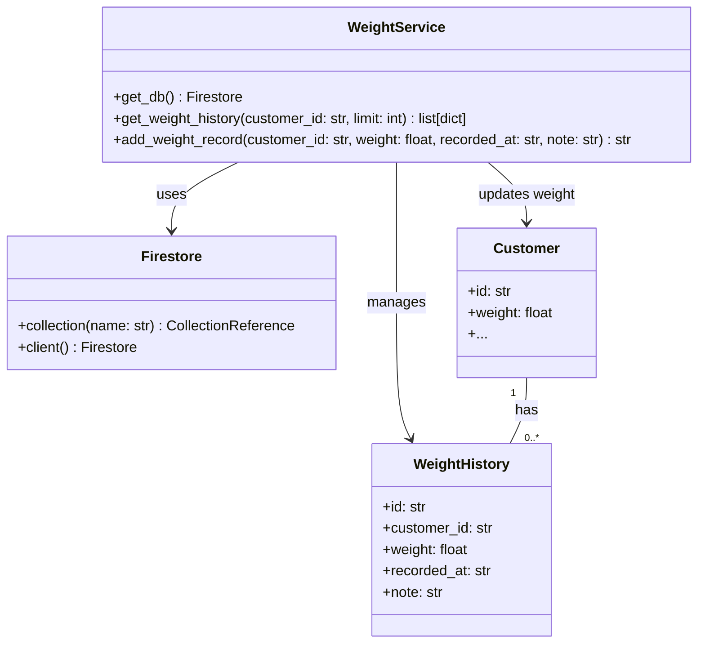
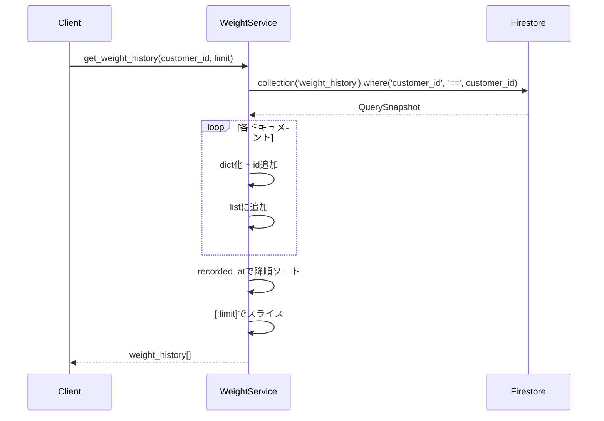
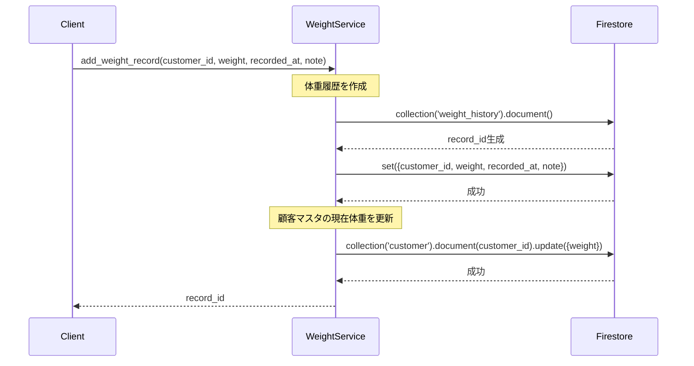
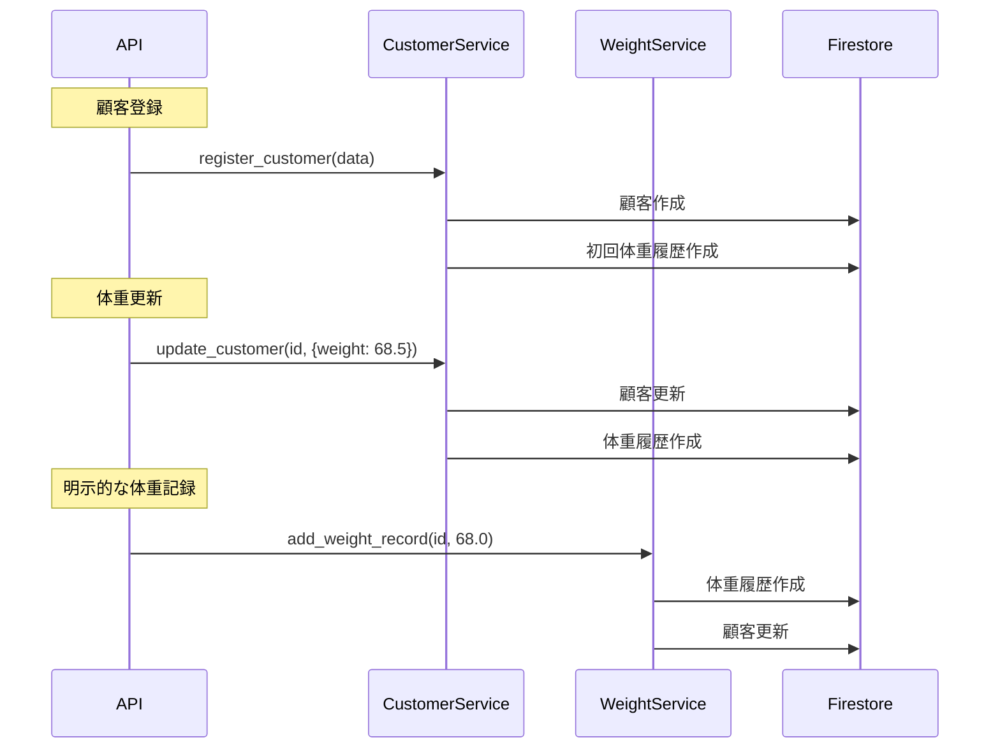

# 詳細設計書: WeightService（体重履歴管理サービス）

**作成日**: 2026年1月4日  
**バージョン**: 1.0  
**担当**: MICHELAバックエンド

---

## 1. 概要

### 1.1 目的
顧客の体重変化を時系列で記録・管理し、ダイエット・筋トレの進捗を可視化する。

### 1.2 責務
- 体重履歴の追加（日時・メモ付き）
- 顧客ごとの体重履歴取得（降順ソート）
- 顧客マスタの現在体重自動更新
- ダッシュボード用データ提供

### 1.3 CustomerServiceとの連携
- 顧客登録時: CustomerServiceが初回体重履歴を自動作成
- 顧客更新時: CustomerServiceが体重更新履歴を自動作成
- 顧客削除時: CustomerServiceが関連履歴をカスケード削除

---

## 2. クラス図



---

## 3. データモデル

### 3.1 WeightHistory（体重履歴）

| フィールド | 型 | 必須 | 説明 | 例 |
|-----------|-----|------|------|-----|
| id | string | ○ | 自動生成ID | "weight_abc123" |
| customer_id | string | ○ | 顧客ID（外部キー） | "customer_xyz789" |
| weight | float | ○ | 体重（kg） | 68.5 |
| recorded_at | string | ○ | 記録日時（ISO 8601） | "2026-01-04T10:30:00" |
| note | string | - | メモ | "初回登録" / "体重更新" / "朝食後" |

**Firestoreパス**: `weight_history/{record_id}`

**インデックス**:
- 単一フィールド: `customer_id` (自動)
- 複合インデックス: **不要**（Pythonでソート）

### 3.2 Customer（顧客マスタ - 参照のみ）

| フィールド | 型 | 説明 |
|-----------|-----|------|
| id | string | 顧客ID |
| weight | float | 現在の体重（最新値） |

**更新タイミング**: `add_weight_record()`呼び出し時に自動更新

---

## 4. メソッド仕様

### 4.1 get_weight_history(customer_id: str, limit: int = 10)

**目的**: 指定顧客の体重履歴を新しい順で取得

**入力パラメータ**:
- `customer_id` (str): 顧客ID
- `limit` (int, default=10): 取得件数上限

**返り値**: `list[dict]`
```python
[
    {
        "id": "weight_001",
        "customer_id": "customer_123",
        "weight": 68.5,
        "recorded_at": "2026-01-04T10:00:00",
        "note": "朝食後"
    },
    {
        "id": "weight_002",
        "customer_id": "customer_123",
        "weight": 69.0,
        "recorded_at": "2026-01-03T10:00:00",
        "note": "体重更新"
    },
    # ... (新しい順に最大limit件)
]
```

**処理フロー**:


**アルゴリズム詳細**:
```python
# 1. Firestoreから全件取得（whereクエリのみ）
query = db.collection('weight_history').where('customer_id', '==', customer_id)

# 2. ストリーミングで取得
for doc in query.stream():
    history = doc.to_dict()
    history['id'] = doc.id
    weight_history.append(history)

# 3. Pythonでソート（Firestoreのorder_by不使用）
weight_history.sort(key=lambda x: x.get('recorded_at', ''), reverse=True)

# 4. limitを適用
return weight_history[:limit]
```

**設計判断**:
- **Firestoreのorder_byを使わない理由**: 複合インデックス不要でコスト削減
- **全件取得→Pythonソートの理由**: 顧客1人あたりの履歴数は数百件程度（メモリ効率問題なし）

**計算量**:
- Firestoreクエリ: O(n) - n = 該当顧客の履歴数
- ソート: O(n log n)
- 合計: O(n log n)

**推奨事項**:
- 履歴数が1000件超える場合: Firestoreのorder_byとlimitを使用
- その場合の複合インデックス: `customer_id (ASC) + recorded_at (DESC)`

---

### 4.2 add_weight_record(customer_id: str, weight: float, recorded_at: str = None, note: str = '')

**目的**: 新しい体重記録を追加し、顧客マスタも更新

**入力パラメータ**:
- `customer_id` (str): 顧客ID
- `weight` (float): 体重（kg）
- `recorded_at` (str, optional): 記録日時（ISO 8601）。未指定時は現在時刻
- `note` (str, default=''): メモ

**返り値**: `str` - 作成された履歴レコードのID

**処理フロー**:


**トランザクション**:
- **現状**: トランザクション未使用
- **影響**: 履歴作成成功→顧客更新失敗の場合、不整合発生の可能性
- **推奨**: Firestore Transactionで2つの書き込みを原子化

**コード例（トランザクション版）**:
```python
from firebase_admin import firestore

@firestore.transactional
def add_weight_record_transaction(transaction, db, customer_id, weight, recorded_at, note):
    # 履歴作成
    weight_ref = db.collection('weight_history').document()
    transaction.set(weight_ref, {
        'customer_id': customer_id,
        'weight': float(weight),
        'recorded_at': recorded_at or datetime.now().isoformat(),
        'note': note
    })
    
    # 顧客更新
    customer_ref = db.collection('customer').document(customer_id)
    transaction.update(customer_ref, {'weight': float(weight)})
    
    return weight_ref.id

# 使用例
db = firestore.client()
transaction = db.transaction()
record_id = add_weight_record_transaction(transaction, db, customer_id, weight, recorded_at, note)
```

**recorded_atのデフォルト値**:
```python
recorded_at = recorded_at or datetime.now().isoformat()
# 例: "2026-01-04T15:30:45.123456"
```

**型変換**:
- `float(weight)`: 整数や文字列で渡されても浮動小数点数に変換

---

## 5. 使用例

### 5.1 体重履歴取得（最新10件）
```python
from app.services import weight_service

# デフォルト10件
history = weight_service.get_weight_history('customer_123')

# 最新20件
history = weight_service.get_weight_history('customer_123', limit=20)

# 表示
for record in history:
    print(f"{record['recorded_at']}: {record['weight']}kg - {record['note']}")
```

**出力例**:
```
2026-01-04T10:00:00: 68.5kg - 朝食後
2026-01-03T10:00:00: 69.0kg - 体重更新
2026-01-02T10:00:00: 69.5kg - 初回登録
```

### 5.2 体重記録追加（現在時刻）
```python
# 現在時刻で記録
record_id = weight_service.add_weight_record(
    customer_id='customer_123',
    weight=68.5,
    note='朝食後'
)
print(f"記録ID: {record_id}")
```

### 5.3 体重記録追加（過去日時指定）
```python
from datetime import datetime

# 過去の記録を追加（バックフィル）
record_id = weight_service.add_weight_record(
    customer_id='customer_123',
    weight=70.0,
    recorded_at='2026-01-01T10:00:00',
    note='正月太り'
)
```

### 5.4 ダッシュボード用データ（初回体重vs現在体重）
```python
# 全履歴取得（limitを大きく設定）
history = weight_service.get_weight_history('customer_123', limit=1000)

if len(history) > 0:
    current_weight = history[0]['weight']  # 最新（降順なので先頭）
    first_weight = history[-1]['weight']   # 初回（降順なので末尾）
    diff = current_weight - first_weight
    
    print(f"初回: {first_weight}kg")
    print(f"現在: {current_weight}kg")
    print(f"変化: {diff:+.1f}kg")
```

---

## 6. エラーハンドリング戦略

### 6.1 顧客不存在エラー
**状況**: 存在しないcustomer_idで`add_weight_record()`を呼び出し

**現在の挙動**:
```python
customer_ref.update({'weight': float(weight)})
# → Firestoreエラー（ドキュメント不存在）
```

**推奨対応**:
```python
# 事前チェック
customer_doc = customer_ref.get()
if not customer_doc.exists:
    raise ValueError(f"Customer {customer_id} not found")
```

### 6.2 無効な体重値
**状況**: 負の値や異常値（例: 0kg, 500kg）

**推奨対応**:
```python
if not (20 <= weight <= 300):
    raise ValueError(f"Invalid weight: {weight}kg (must be 20-300kg)")
```

### 6.3 日時フォーマットエラー
**状況**: 不正なrecorded_at形式

**推奨対応**:
```python
from datetime import datetime

if recorded_at:
    try:
        datetime.fromisoformat(recorded_at)
    except ValueError:
        raise ValueError(f"Invalid datetime format: {recorded_at}")
```

---

## 7. パフォーマンス考慮事項

### 7.1 クエリ最適化

**現在の実装**:
```python
# whereのみ（インデックス: customer_id単体）
query = db.collection('weight_history').where('customer_id', '==', customer_id)
```

**利点**:
- 複合インデックス不要（Firestore料金削減）
- シンプルなクエリ構造

**欠点**:
- 全件取得後にPythonでソート（メモリ使用）
- limit適用がFirestore側でできない

**代替案（パフォーマンス優先）**:
```python
# Firestoreのorder_byとlimitを使用
query = db.collection('weight_history')\
          .where('customer_id', '==', customer_id)\
          .order_by('recorded_at', direction=firestore.Query.DESCENDING)\
          .limit(limit)
```

**必要な複合インデックス**:
```
Collection: weight_history
Fields: customer_id (ASC), recorded_at (DESC)
```

**推奨閾値**:
- 履歴数 < 100件: 現在の実装（Pythonソート）
- 履歴数 ≥ 100件: Firestoreソート + 複合インデックス

### 7.2 ネットワーク効率

**add_weight_record()の書き込み回数**:
- 体重履歴: 1回
- 顧客マスタ: 1回
- **合計**: 2回

**最適化案**: バッチ書き込み
```python
batch = db.batch()
batch.set(weight_ref, weight_data)
batch.update(customer_ref, {'weight': float(weight)})
batch.commit()  # 1回のネットワークリクエスト
```

---

## 8. セキュリティ考慮事項

### 8.1 認可チェック
**現状**: 任意の顧客IDで履歴取得・追加可能

**推奨対応**:
```python
def get_weight_history(customer_id, limit=10, requesting_user_id=None):
    # ユーザーが自分の顧客データのみアクセス可能か確認
    if requesting_user_id and not is_authorized(requesting_user_id, customer_id):
        raise PermissionError("Access denied")
    
    # ... 既存処理
```

### 8.2 データ整合性
**リスク**: 顧客削除後も体重履歴が残る

**対策**: CustomerServiceのdelete_customer()でカスケード削除実装済み

### 8.3 プライバシー
**個人情報**: 体重データ（要配慮個人情報）

**推奨対応**:
- 暗号化: Firestore at-rest encryption（自動有効）
- アクセスログ: Cloud Logging有効化
- データ保持期間: 顧客削除後の完全削除ポリシー

---

## 9. テスト戦略

### 9.1 単体テスト（実装済み）

| テストケース | 内容 | カバレッジ |
|-------------|------|-----------|
| `test_get_weight_history` | 履歴取得（降順ソート確認） | ○ |
| `test_add_weight_record_with_timestamp` | 日時指定で記録追加 | ○ |
| `test_add_weight_record_without_timestamp` | 現在時刻で記録追加 | ○ |
| `test_get_weight_history_empty` | 履歴0件の場合 | ○ |
| `test_add_weight_record_error_handling` | 例外処理 | ○ |
| `test_get_weight_history_error_handling` | 例外処理 | ○ |

**カバレッジ**: 76%（Branch Coverage）

**未カバー箇所**:
- `get_db()`関数本体
- 顧客マスタ更新の失敗ケース

### 9.2 推奨追加テスト

```python
def test_add_weight_record_updates_customer():
    """体重記録追加時に顧客マスタが更新されることを確認"""
    # Setup
    customer_id = "test_customer"
    initial_weight = 70.0
    new_weight = 68.5
    
    # 顧客作成
    customer_service.register_customer({
        "name": "Test User",
        "age": 25,
        "height": 175,
        "weight": initial_weight,
        # ...
    })
    
    # 体重記録追加
    weight_service.add_weight_record(customer_id, new_weight)
    
    # 顧客マスタ確認
    customer, _ = customer_service.get_customer_by_id(customer_id)
    assert customer['weight'] == new_weight

def test_weight_history_ordering():
    """複数記録の降順ソートを確認"""
    customer_id = "test_customer"
    
    # 異なる日時で3件追加
    weight_service.add_weight_record(customer_id, 70.0, "2026-01-01T10:00:00")
    weight_service.add_weight_record(customer_id, 69.0, "2026-01-02T10:00:00")
    weight_service.add_weight_record(customer_id, 68.0, "2026-01-03T10:00:00")
    
    # 取得
    history = weight_service.get_weight_history(customer_id, limit=3)
    
    # 検証
    assert history[0]['recorded_at'] == "2026-01-03T10:00:00"  # 最新
    assert history[1]['recorded_at'] == "2026-01-02T10:00:00"
    assert history[2]['recorded_at'] == "2026-01-01T10:00:00"  # 最古
```

---

## 10. 統合ポイント

### 10.1 CustomerService連携



**重複記録の可能性**:
- `update_customer({weight: 68.5})`と`add_weight_record(68.5)`を同時実行
- → 同じ体重で2件の履歴が作成される

**推奨対応**:
- API層で排他制御
- または、CustomerServiceの体重更新をWeightServiceに委譲

### 10.2 ダッシュボード連携
```python
# dashboard/page.tsx用のデータ取得
history = weight_service.get_weight_history(customer_id, limit=1000)

dashboard_data = {
    "first_weight": history[-1]['weight'] if history else None,
    "current_weight": history[0]['weight'] if history else None,
    "weight_diff": (history[0]['weight'] - history[-1]['weight']) if len(history) > 1 else 0,
    "last_updated": history[0]['recorded_at'] if history else None
}
```

---

## 11. 変更履歴

| 日付 | バージョン | 変更内容 | 担当 |
|------|-----------|---------|------|
| 2026-01-04 | 1.0 | 初版作成（モックチェーン修正後） | System |

---

## 12. 関連ドキュメント

- [Customer Service設計書](01_customer_service_design.md)（顧客管理）
- [API設計書](../api/endpoints.md)（RESTエンドポイント）
- [Dashboard実装](../../frontend/src/app/dashboard/page.tsx)（フロントエンド連携）
- [WeightChart Component](../../frontend/src/components/WeightChart.tsx)（グラフ表示）
