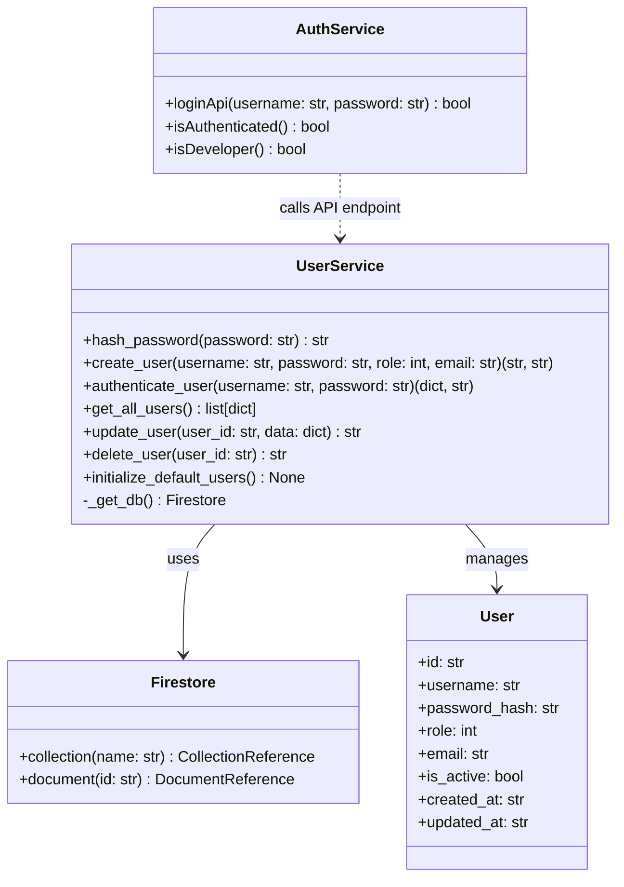
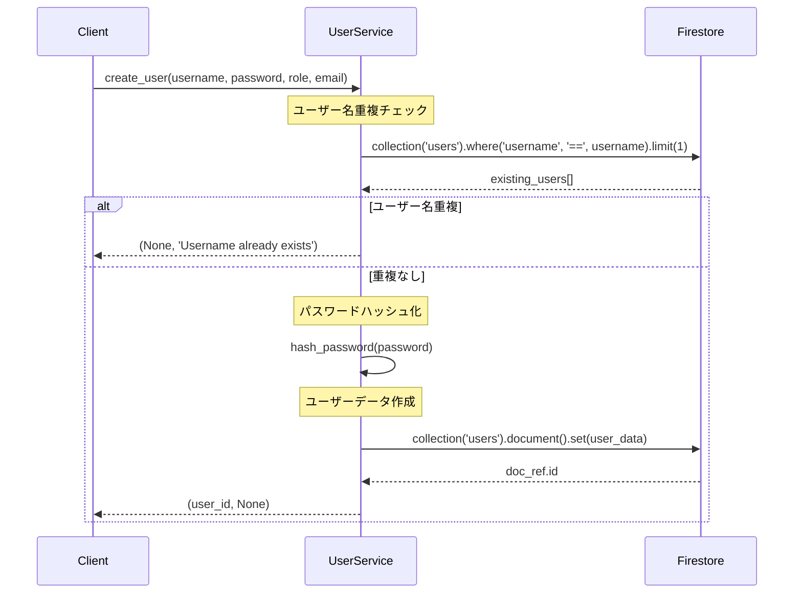
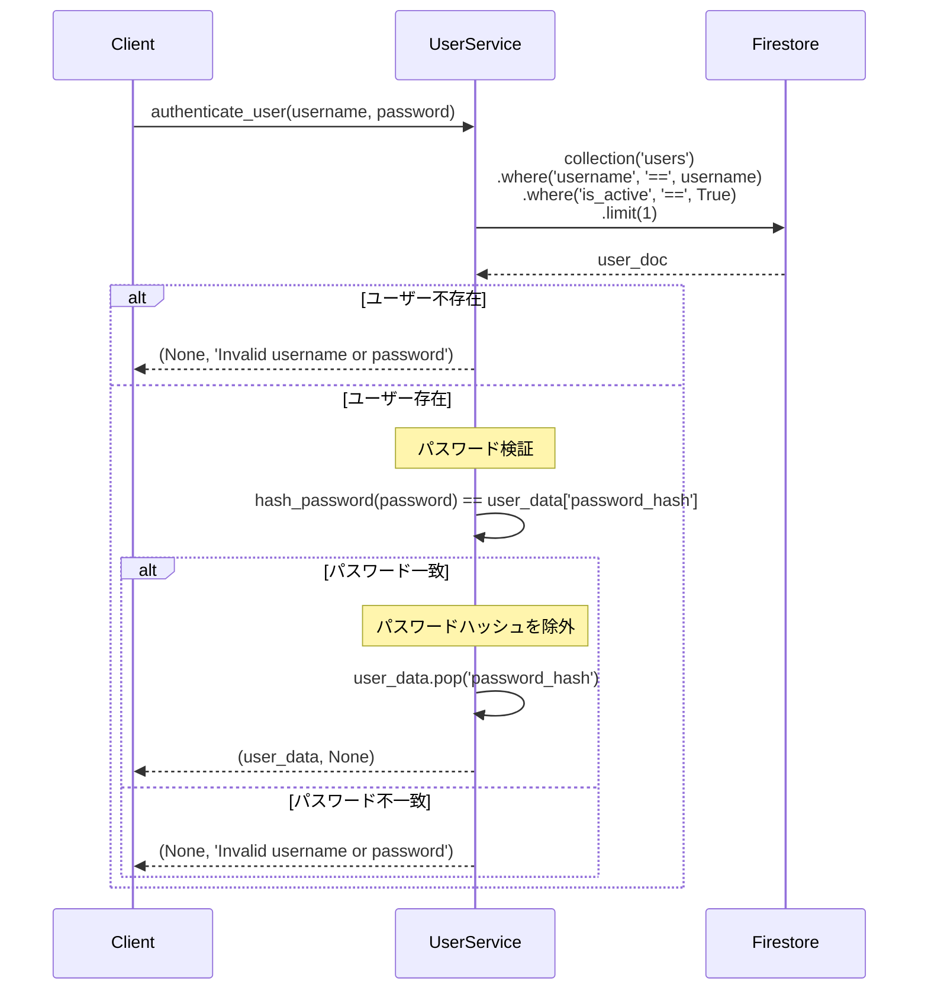
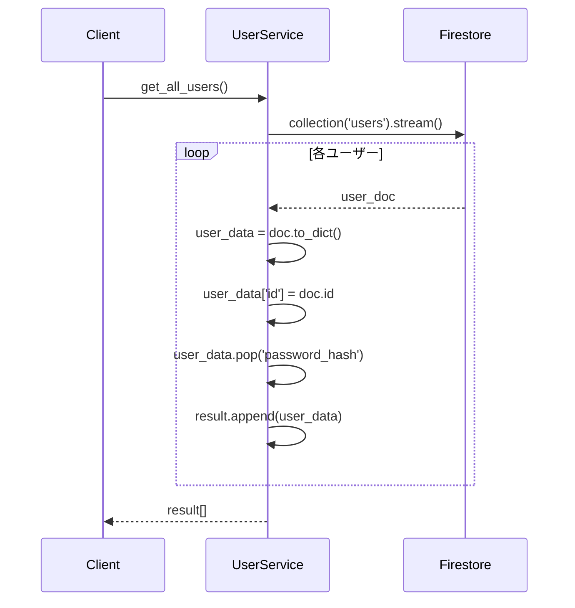
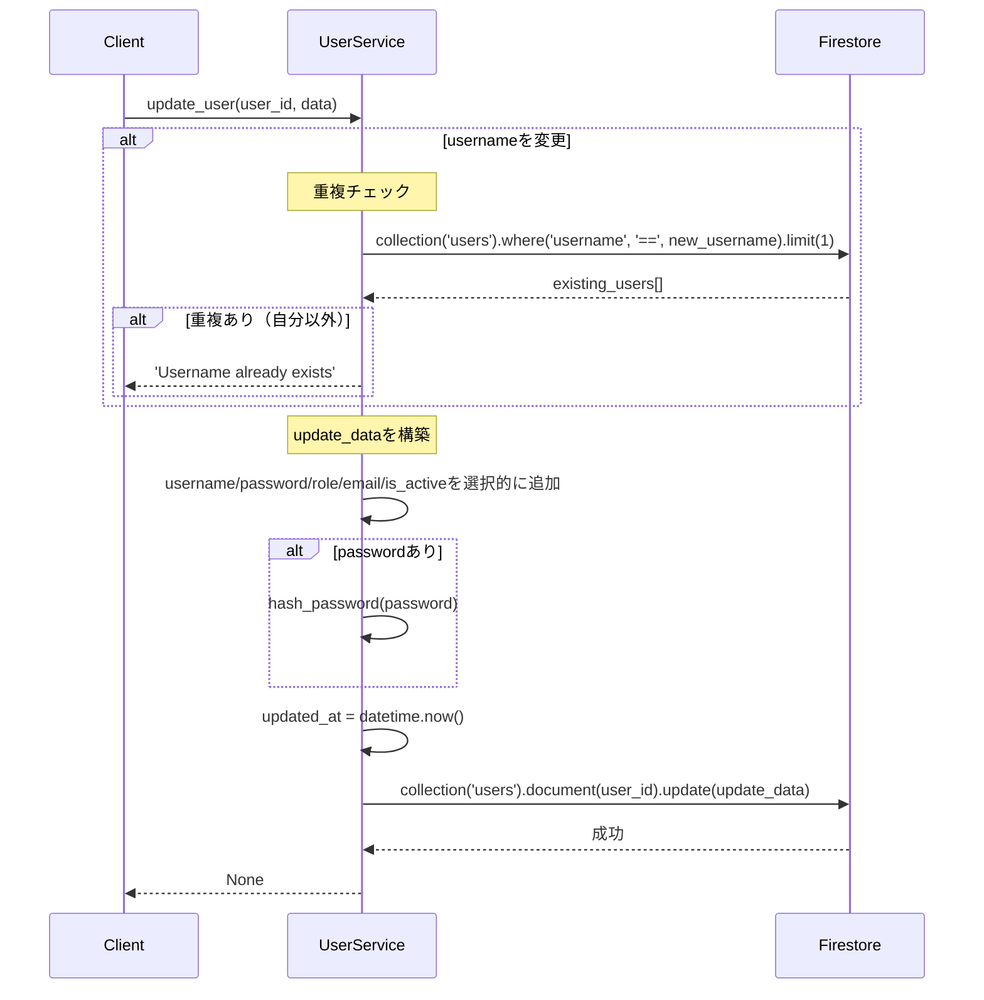
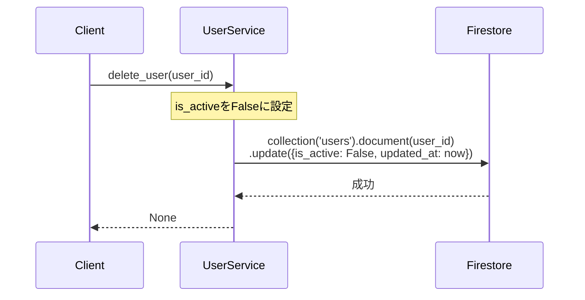
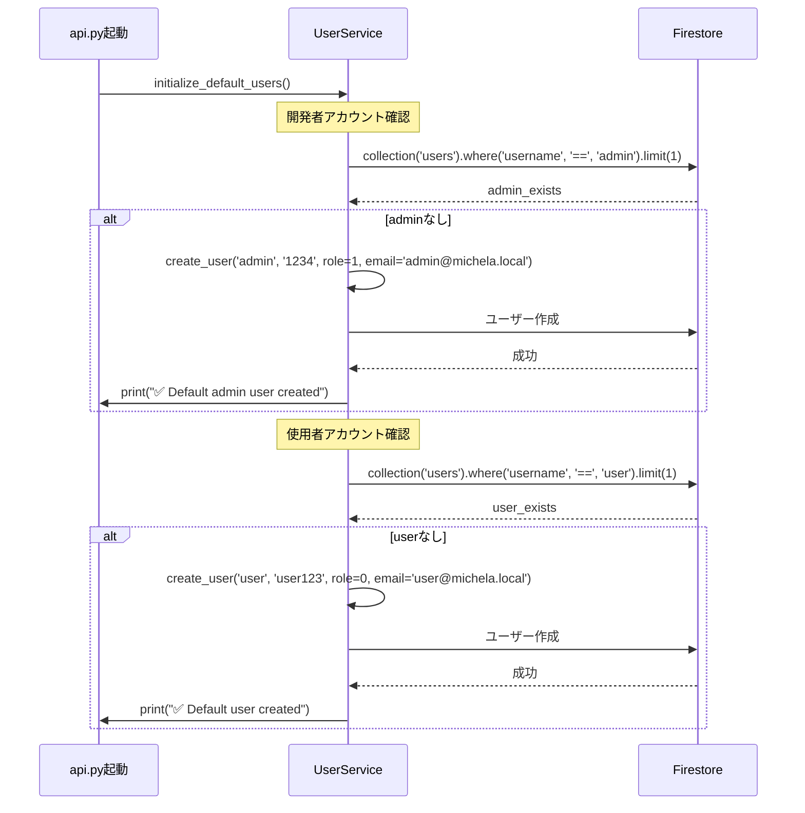
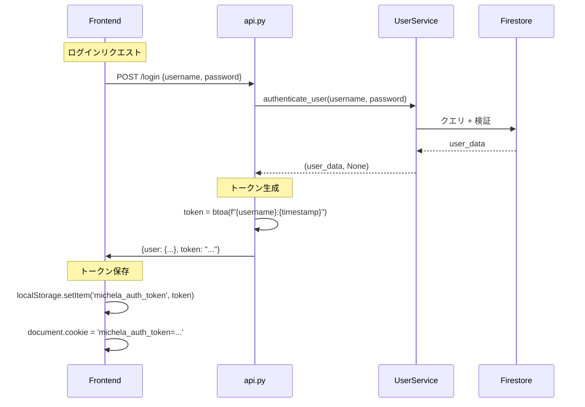

# 詳細設計書: UserService（ユーザー管理・認証サービス）

**作成日**: 2026年1月4日  
**バージョン**: 1.0  
**担当**: MICHELAバックエンド

---

## 1. 概要

### 1.1 目的
MICHELAシステムのユーザー認証・認可を管理し、開発者と使用者の権限分離を実現する。

### 1.2 責務
- ユーザーアカウント作成（重複チェック）
- パスワードハッシュ化（SHA-256）
- ログイン認証（ユーザー名 + パスワード）
- ロールベースアクセス制御（role 0=使用者, role 1=開発者）
- 論理削除（is_activeフラグ）
- デフォルトユーザー初期化

### 1.3 セキュリティポリシー
- **パスワード保管**: SHA-256ハッシュのみ保存（平文保存禁止）
- **パスワード送信**: レスポンスにpassword_hashを含めない
- **アカウント無効化**: is_active=Falseで論理削除（データは保持）

---

## 2. クラス図



---

## 3. データモデル

### 3.1 User（ユーザー）

| フィールド | 型 | 必須 | 説明 | 例 |
|-----------|-----|------|------|-----|
| id | string | ○ | 自動生成ID | "user_abc123" |
| username | string | ○ | ログイン名（ユニーク） | "admin", "user" |
| password_hash | string | ○ | SHA-256ハッシュ（64文字） | "03ac674216f3..." |
| role | int | ○ | 0=使用者, 1=開発者 | 0, 1 |
| email | string | - | メールアドレス | "admin@michela.local" |
| is_active | bool | ○ | アカウント有効フラグ | true, false |
| created_at | string | ○ | 作成日時（ISO 8601） | "2026-01-04T10:00:00" |
| updated_at | string | ○ | 更新日時（ISO 8601） | "2026-01-04T15:00:00" |

**Firestoreパス**: `users/{user_id}`

**インデックス**:
- 単一フィールド: `username` (自動)
- 複合インデックス: `username (ASC) + is_active (ASC)` (authenticate_user用)

### 3.2 Role定義

```python
ROLE_USER = 0       # 使用者: 顧客管理・記録入力
ROLE_DEVELOPER = 1  # 開発者: 上記 + バックアップ・管理機能
```

**権限マトリクス**:

| 機能 | 使用者 (role=0) | 開発者 (role=1) |
|------|----------------|----------------|
| 顧客管理 | ○ | ○ |
| 体重・トレーニング記録 | ○ | ○ |
| AI相談・研究検索 | ○ | ○ |
| **バックアップ・復元** | ✕ | ○ |
| **ユーザー管理** | ✕ | ○ |

---

## 4. メソッド仕様

### 4.1 hash_password(password: str) → str

**目的**: パスワードをSHA-256でハッシュ化

**入力パラメータ**:
- `password` (str): 平文パスワード

**返り値**: `str` - 64文字の16進数文字列

**アルゴリズム**:
```python
import hashlib

hash_password = hashlib.sha256(password.encode()).hexdigest()
# 例: "1234" → "03ac674216f3e15c761ee1a5e255f067953623c8b388b4459e13f978d7c846f4"
```

**特性**:
- **決定性**: 同じ入力は常に同じ出力
- **一方向性**: ハッシュから平文パスワードは復元不可能
- **衝突耐性**: 異なる入力で同じハッシュになる確率は極小

**セキュリティ評価**:
- ✅ **利点**: SHA-256は高速で標準ライブラリで利用可能
- ⚠️ **欠点**: ソルトなし（レインボーテーブル攻撃に脆弱）
- ⚠️ **欠点**: 単純ハッシュ（GPU並列攻撃に脆弱）

**推奨改善案**:
```python
import bcrypt

def hash_password(password: str) -> str:
    """bcryptでソルト付きハッシュ化"""
    return bcrypt.hashpw(password.encode(), bcrypt.gensalt()).decode()
```

---

### 4.2 create_user(username: str, password: str, role: int = 0, email: str = None)

**目的**: 新規ユーザーアカウントを作成

**入力パラメータ**:
- `username` (str): ログイン名（ユニーク）
- `password` (str): 平文パスワード（ハッシュ化される）
- `role` (int, default=0): 0=使用者, 1=開発者
- `email` (str, optional): メールアドレス

**返り値**: `tuple[str | None, str | None]`
- 成功: `(user_id, None)`
- 失敗: `(None, error_message)`

**処理フロー**:


**ユーザーデータ構造**:
```python
user_data = {
    'username': username,
    'password_hash': hash_password(password),
    'role': role,
    'email': email,
    'is_active': True,
    'created_at': datetime.now().isoformat(),
    'updated_at': datetime.now().isoformat()
}
```

**エラーハンドリング**:
- ユーザー名重複: `(None, 'Username already exists')`
- Firestore例外: `(None, str(e))`

---

### 4.3 authenticate_user(username: str, password: str)

**目的**: ユーザー名とパスワードで認証

**入力パラメータ**:
- `username` (str): ログイン名
- `password` (str): 平文パスワード

**返り値**: `tuple[dict | None, str | None]`
- 成功: `(user_data, None)`
- 失敗: `(None, 'Invalid username or password')`

**user_dataの内容**（成功時）:
```python
{
    "id": "user_123",
    "username": "admin",
    "role": 1,
    "email": "admin@michela.local"
}
# 注意: password_hashは除外される
```

**処理フロー**:


**セキュリティポイント**:
- ✅ ユーザー不存在とパスワード不一致で同じエラーメッセージ（列挙攻撃対策）
- ✅ is_active=Falseのユーザーは認証拒否
- ✅ レスポンスにpassword_hashを含めない

**タイミング攻撃対策**（推奨）:
```python
import time

# 固定時間遅延でタイミング攻撃を防ぐ
time.sleep(0.1)  # 100ms遅延
```

---

### 4.4 get_all_users() → list[dict]

**目的**: 全ユーザーを取得（管理者用）

**返り値**: `list[dict]`
```python
[
    {
        "id": "user_1",
        "username": "admin",
        "role": 1,
        "email": "admin@michela.local",
        "is_active": True,
        "created_at": "2026-01-01T00:00:00",
        "updated_at": "2026-01-01T00:00:00"
    },
    {
        "id": "user_2",
        "username": "user",
        "role": 0,
        "email": "user@michela.local",
        "is_active": True,
        "created_at": "2026-01-01T00:00:00",
        "updated_at": "2026-01-01T00:00:00"
    }
]
# 注意: password_hashは除外される
```

**処理フロー**:


**権限チェック**（API層で実装）:
```python
# api.py
@app.route('/get_users', methods=['GET'])
def get_users():
    # リクエストユーザーの権限確認
    if not is_developer(request_user_id):
        return jsonify({'error': 'Permission denied'}), 403
    
    users = user_service.get_all_users()
    return jsonify(users), 200
```

---

### 4.5 update_user(user_id: str, data: dict)

**目的**: ユーザー情報を更新

**入力パラメータ**:
- `user_id` (str): 更新対象ユーザーID
- `data` (dict): 更新データ
  - `username` (str, optional): 新しいユーザー名
  - `password` (str, optional): 新しいパスワード（平文）
  - `role` (int, optional): 新しいロール
  - `email` (str, optional): 新しいメール
  - `is_active` (bool, optional): アクティブフラグ

**返り値**: `str | None`
- 成功: `None`
- 失敗: エラーメッセージ文字列

**処理フロー**:


**部分更新の例**:
```python
# パスワードのみ変更
update_user('user_123', {'password': 'newpass456'})

# ユーザー名とロールを変更
update_user('user_123', {'username': 'newname', 'role': 1})
```

**注意事項**:
- 空のパスワード（`''`）は無視される（`if data['password']`チェック）
- `updated_at`は常に更新される

---

### 4.6 delete_user(user_id: str)

**目的**: ユーザーを論理削除

**入力パラメータ**:
- `user_id` (str): 削除対象ユーザーID

**返り値**: `str | None`
- 成功: `None`
- 失敗: エラーメッセージ文字列

**処理フロー**:


**論理削除の理由**:
- ✅ データ監査証跡を保持
- ✅ 顧客との紐付けデータが残る
- ✅ 誤削除時の復旧が可能

**物理削除が必要な場合**:
```python
def hard_delete_user(user_id: str):
    """完全削除（GDPR対応等）"""
    db = _get_db()
    db.collection('users').document(user_id).delete()
```

---

### 4.7 initialize_default_users()

**目的**: 初回セットアップ時にデフォルトユーザーを作成

**処理フロー**:


**デフォルトアカウント**:
```python
# 開発者アカウント
Username: admin
Password: 1234
Role: 1 (開発者)
Email: admin@michela.local

# 使用者アカウント
Username: user
Password: user123
Role: 0 (使用者)
Email: user@michela.local
```

**セキュリティ警告**:
⚠️ **本番環境では必ずパスワード変更すること**

---

## 5. 使用例

### 5.1 ユーザー作成（API経由）
```python
from app.services import user_service

# 使用者アカウント作成
user_id, error = user_service.create_user(
    username='john_doe',
    password='SecurePass123!',
    role=0,
    email='john@example.com'
)

if error:
    print(f"エラー: {error}")
else:
    print(f"ユーザー作成成功: {user_id}")
```

### 5.2 ログイン認証
```python
# Frontend → Backend APIリクエスト
response = await fetch('/login', {
    method: 'POST',
    headers: {'Content-Type': 'application/json'},
    body: JSON.stringify({username: 'admin', password: '1234'})
})

# Backend処理
user_data, error = user_service.authenticate_user('admin', '1234')

if error:
    return jsonify({'error': error}), 401
else:
    # トークン生成（簡易版）
    token = btoa(f"{username}:{time.time()}")
    return jsonify({
        'user': user_data,
        'token': token
    }), 200
```

### 5.3 権限チェック（ミドルウェア）
```python
# middleware.ts (Next.js)
export function middleware(request: NextRequest) {
    const token = request.cookies.get('michela_auth_token');
    
    if (!token && isProtectedRoute(request.nextUrl.pathname)) {
        return NextResponse.redirect(new URL('/', request.url));
    }
    
    return NextResponse.next();
}

# useRole.ts (React Hook)
export const useRole = () => {
    const user = getCurrentUser();
    return {
        isDeveloper: user?.role === 1,
        isUser: user?.role === 0
    };
};
```

### 5.4 ユーザー管理（管理画面）
```python
# 全ユーザー取得
users = user_service.get_all_users()
for user in users:
    print(f"{user['username']} ({user['role']}) - Active: {user['is_active']}")

# ユーザー更新
user_service.update_user('user_123', {
    'role': 1,  # 使用者→開発者に昇格
    'email': 'newemail@example.com'
})

# ユーザー無効化
user_service.delete_user('user_456')
```

---

## 6. エラーハンドリング戦略

### 6.1 ユーザー名重複エラー
**状況**: 既存ユーザー名で`create_user()`または`update_user()`

**検出方法**:
```python
existing_users = db.collection('users').where('username', '==', username).limit(1).stream()
if any(existing_users):
    return None, 'Username already exists'
```

**フロントエンド表示**:
```typescript
if (error === 'Username already exists') {
    toast.error('このユーザー名は既に使用されています');
}
```

### 6.2 認証失敗エラー
**状況**: 不正なユーザー名またはパスワード

**セキュリティ設計**:
- ❌ "ユーザーが存在しません" → ユーザー列挙攻撃
- ❌ "パスワードが間違っています" → 同上
- ✅ **統一エラーメッセージ**: "Invalid username or password"

**推奨対応**:
```python
# タイミング攻撃対策（オプション）
import time
import secrets

# ランダム遅延（100-200ms）
time.sleep(0.1 + secrets.randbelow(100) / 1000)
return None, 'Invalid username or password'
```

### 6.3 例外処理
**Firestore例外**:
```python
try:
    # Firestore操作
except Exception as e:
    # ログ出力
    print(f"User service error: {e}")
    # エラーメッセージ返却
    return None, str(e)
```

**推奨改善**:
- カスタム例外クラス定義
- ログレベル分離（ERROR/WARNING/INFO）
- エラー詳細とユーザー向けメッセージの分離

---

## 7. パフォーマンス考慮事項

### 7.1 認証クエリの最適化

**現在の実装**:
```python
users = db.collection('users')\
          .where('username', '==', username)\
          .where('is_active', '==', True)\
          .limit(1).stream()
```

**必要なインデックス**:
```
Collection: users
Fields: username (ASC), is_active (ASC)
```

**クエリコスト**: 1ドキュメント読み取り（limit=1）

### 7.2 パスワードハッシュの計算量

**SHA-256のパフォーマンス**:
- 処理時間: ~0.01ms (Python標準ライブラリ)
- 認証1回あたり: 1回のハッシュ計算

**bcryptとの比較**:
- SHA-256: 0.01ms（高速だが脆弱）
- bcrypt: 100ms（遅いが安全、ソルト+ストレッチング）

**推奨**: 本番環境ではbcryptやArgon2を使用

### 7.3 get_all_users()のスケーラビリティ

**現在の実装**: 全ユーザーを一度に取得
```python
users = db.collection('users').stream()
```

**推奨改善**（ユーザー数 > 100の場合）:
```python
def get_all_users_paginated(page_size=20, last_doc_id=None):
    """ページネーション対応"""
    query = db.collection('users').limit(page_size)
    
    if last_doc_id:
        last_doc = db.collection('users').document(last_doc_id).get()
        query = query.start_after(last_doc)
    
    return [doc.to_dict() for doc in query.stream()]
```

---

## 8. セキュリティ考慮事項

### 8.1 パスワードポリシー

**現状**: パスワード強度チェックなし

**推奨実装**:
```python
import re

def validate_password(password: str) -> tuple[bool, str]:
    """パスワード強度検証"""
    if len(password) < 8:
        return False, 'Password must be at least 8 characters'
    
    if not re.search(r'[A-Z]', password):
        return False, 'Password must contain uppercase letter'
    
    if not re.search(r'[a-z]', password):
        return False, 'Password must contain lowercase letter'
    
    if not re.search(r'[0-9]', password):
        return False, 'Password must contain number'
    
    return True, ''

# create_userで使用
def create_user(username, password, ...):
    valid, error = validate_password(password)
    if not valid:
        return None, error
    # ...
```

### 8.2 ブルートフォース攻撃対策

**現状**: レート制限なし

**推奨実装**:
```python
from datetime import datetime, timedelta

# メモリキャッシュ（本番環境ではRedis使用）
login_attempts = {}

def check_rate_limit(username: str) -> tuple[bool, str]:
    """ログイン試行回数制限"""
    if username in login_attempts:
        attempts, last_attempt = login_attempts[username]
        
        # 5分以内に5回失敗
        if attempts >= 5 and datetime.now() - last_attempt < timedelta(minutes=5):
            return False, 'Too many login attempts. Try again in 5 minutes.'
    
    return True, ''

# authenticate_userで使用
def authenticate_user(username, password):
    allowed, error = check_rate_limit(username)
    if not allowed:
        return None, error
    
    # 認証処理
    user_data, auth_error = ...
    
    if auth_error:
        # 失敗回数をカウント
        attempts = login_attempts.get(username, (0, None))[0] + 1
        login_attempts[username] = (attempts, datetime.now())
    else:
        # 成功時はリセット
        login_attempts.pop(username, None)
    
    return user_data, auth_error
```

### 8.3 セッション管理

**現状**: シンプルなトークン（Base64エンコード）
```python
token = btoa(f"{username}:{timestamp}")
```

**推奨改善**:
```python
import jwt
import secrets

# JWT（JSON Web Token）使用
def generate_token(user_data: dict) -> str:
    """JWTトークン生成"""
    payload = {
        'user_id': user_data['id'],
        'username': user_data['username'],
        'role': user_data['role'],
        'exp': datetime.now() + timedelta(days=1),  # 1日有効
        'jti': secrets.token_urlsafe(16)  # トークンID（ユニーク）
    }
    
    return jwt.encode(payload, SECRET_KEY, algorithm='HS256')

def verify_token(token: str) -> dict | None:
    """JWTトークン検証"""
    try:
        payload = jwt.decode(token, SECRET_KEY, algorithms=['HS256'])
        return payload
    except jwt.ExpiredSignatureError:
        return None  # トークン期限切れ
    except jwt.InvalidTokenError:
        return None  # 不正なトークン
```

---

## 9. テスト戦略

### 9.1 単体テスト（実装済み）

| テストケース | 内容 | カバレッジ |
|-------------|------|-----------|
| `test_hash_password` | SHA-256ハッシュ化の一貫性 | ○ |
| `test_create_user_success` | ユーザー作成成功 | ○ |
| `test_create_user_duplicate_username` | 重複ユーザー名エラー | ○ |
| `test_authenticate_user_success` | 認証成功 | ○ |
| `test_authenticate_user_wrong_password` | パスワード不一致 | ○ |
| `test_authenticate_user_not_found` | ユーザー不存在 | ○ |
| `test_get_all_users` | 全ユーザー取得 | ○ |
| `test_update_user_success` | ユーザー更新成功 | ○ |
| `test_update_user_duplicate_username` | 更新時の重複チェック | ○ |
| `test_delete_user_success` | 論理削除成功 | ○ |
| `test_create_user_error_handling` | 例外処理 | ○ |
| `test_authenticate_user_error_handling` | 例外処理 | ○ |
| `test_update_user_error_handling` | 例外処理 | ○ |
| `test_delete_user_error_handling` | 例外処理 | ○ |

**カバレッジ**: 92%（Branch Coverage）

**未カバー箇所**:
- `_get_db()`関数本体
- `initialize_default_users()`の一部分岐

### 9.2 推奨追加テスト

```python
def test_password_hash_cannot_be_reversed():
    """ハッシュから平文パスワードが復元できないことを確認"""
    password = "SecurePassword123"
    hashed = user_service.hash_password(password)
    
    # 総当たり攻撃シミュレーション（簡易版）
    common_passwords = ["password", "123456", "admin", ...]
    for common_pass in common_passwords:
        assert user_service.hash_password(common_pass) != hashed

def test_inactive_user_cannot_login():
    """is_active=Falseのユーザーはログインできない"""
    # ユーザー作成
    user_id, _ = user_service.create_user('testuser', 'pass123')
    
    # 無効化
    user_service.delete_user(user_id)
    
    # ログイン試行
    user_data, error = user_service.authenticate_user('testuser', 'pass123')
    
    assert user_data is None
    assert error == 'Invalid username or password'

def test_password_hash_excluded_from_responses():
    """すべてのレスポンスでpassword_hashが除外されることを確認"""
    # ユーザー作成
    user_id, _ = user_service.create_user('testuser', 'pass123', email='test@example.com')
    
    # 認証
    user_data, _ = user_service.authenticate_user('testuser', 'pass123')
    assert 'password_hash' not in user_data
    
    # 全ユーザー取得
    all_users = user_service.get_all_users()
    for user in all_users:
        assert 'password_hash' not in user
```

### 9.3 統合テスト（推奨）

```python
def test_full_user_lifecycle():
    """ユーザーのライフサイクル全体をテスト"""
    # 1. 作成
    user_id, error = user_service.create_user('lifecycle_user', 'pass123', role=0)
    assert error is None
    
    # 2. ログイン
    user_data, error = user_service.authenticate_user('lifecycle_user', 'pass123')
    assert error is None
    assert user_data['role'] == 0
    
    # 3. 更新（昇格）
    error = user_service.update_user(user_id, {'role': 1, 'email': 'new@example.com'})
    assert error is None
    
    # 4. 再ログイン（データ確認）
    user_data, error = user_service.authenticate_user('lifecycle_user', 'pass123')
    assert user_data['role'] == 1
    assert user_data['email'] == 'new@example.com'
    
    # 5. 削除
    error = user_service.delete_user(user_id)
    assert error is None
    
    # 6. ログイン失敗確認
    user_data, error = user_service.authenticate_user('lifecycle_user', 'pass123')
    assert user_data is None
```

---

## 10. 統合ポイント

### 10.1 API層（Flask）



**api.py実装**:
```python
@app.route('/login', methods=['POST'])
def login():
    data = request.json
    if not data or 'username' not in data or 'password' not in data:
        return jsonify({"error": "Username and password are required"}), 400
    
    user_data, error = user_service.authenticate_user(data['username'], data['password'])
    if error:
        return jsonify({'error': error}), 401
    
    return jsonify({
        "message": "Login successful",
        "user": user_data
    }), 200
```

### 10.2 ミドルウェア（Next.js）

**middleware.ts**（ルートガード）:
```typescript
export function middleware(request: NextRequest) {
    const { pathname } = request.nextUrl;
    const protectedRoutes = ['/dashboard', '/customer'];
    
    const isProtectedRoute = protectedRoutes.some(route =>
        pathname.startsWith(route)
    );
    
    if (isProtectedRoute) {
        const token = request.cookies.get('michela_auth_token');
        
        if (!token) {
            return NextResponse.redirect(new URL('/', request.url));
        }
    }
    
    return NextResponse.next();
}
```

### 10.3 フロントエンド（React Hooks）

**useAuth.ts**（認証チェック）:
```typescript
export const useAuth = () => {
    const router = useRouter();
    
    useEffect(() => {
        if (!isAuthenticated()) {
            router.push("/");
        }
    }, [router]);
    
    return { isAuthenticated: isAuthenticated() };
};
```

**useRole.ts**（権限チェック）:
```typescript
export const useRole = () => {
    const user = getCurrentUser();
    
    return {
        isDeveloper: user?.role === 1,
        isUser: user?.role === 0
    };
};
```

---

## 11. 変更履歴

| 日付 | バージョン | 変更内容 | 担当 |
|------|-----------|---------|------|
| 2026-01-04 | 1.0 | 初版作成（SHA-256ハッシュ + 論理削除設計） | System |

---

## 12. 関連ドキュメント

- [API設計書](../api/endpoints.md)（/loginエンドポイント）
- [authService.ts](../../frontend/src/services/authService.ts)（フロントエンド認証サービス）
- [middleware.ts](../../frontend/src/middleware.ts)（Next.jsルートガード）
- [useRole.ts](../../frontend/src/hooks/useRole.ts)（権限チェックフック）
- [セキュリティガイドライン](../security/password_policy.md)（推奨）
