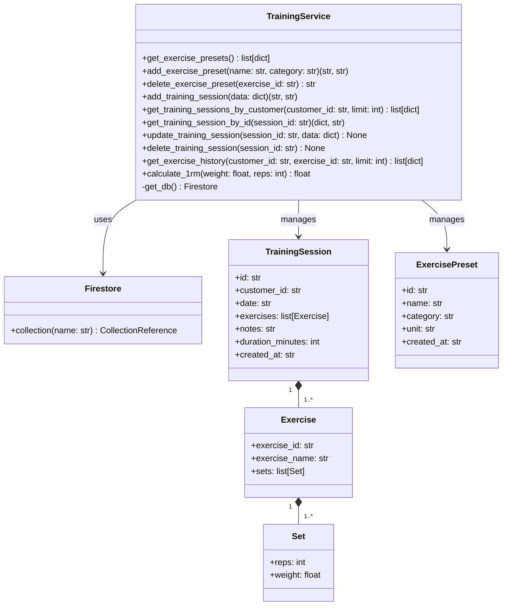
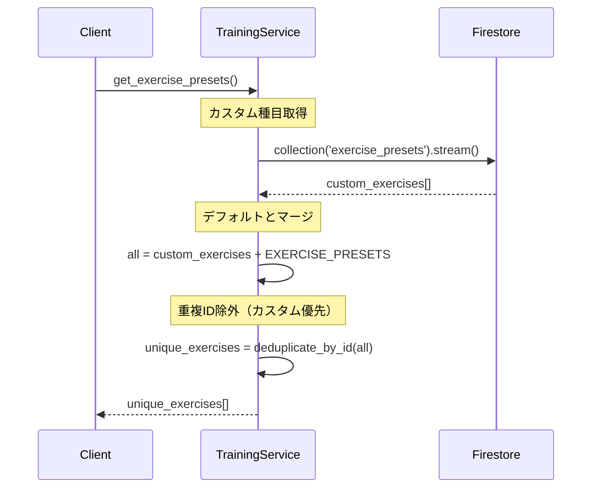
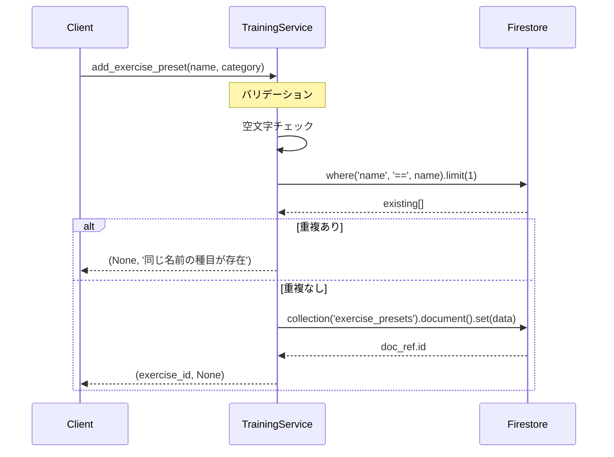
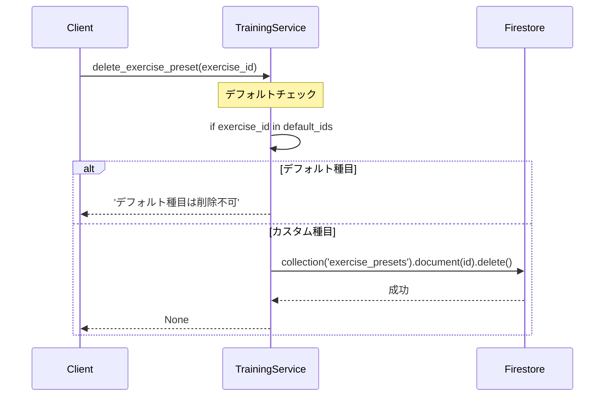
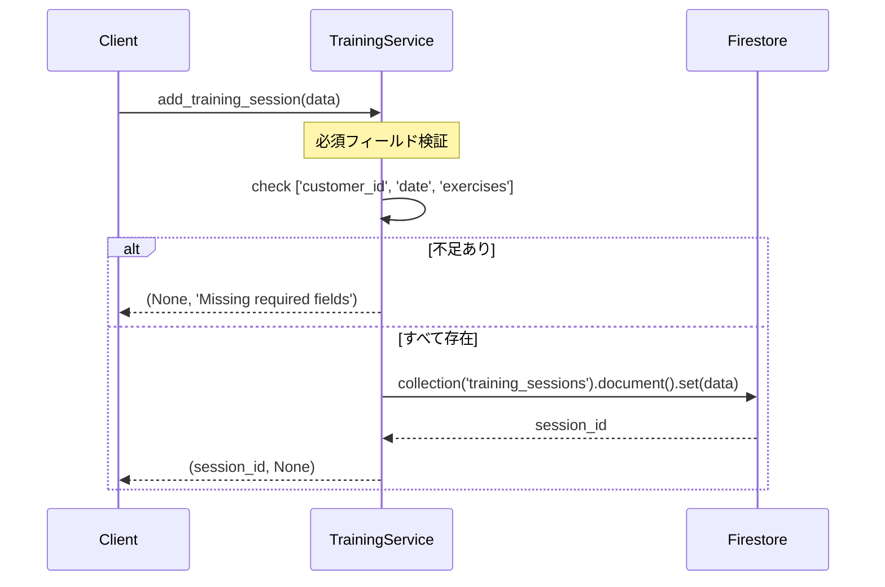
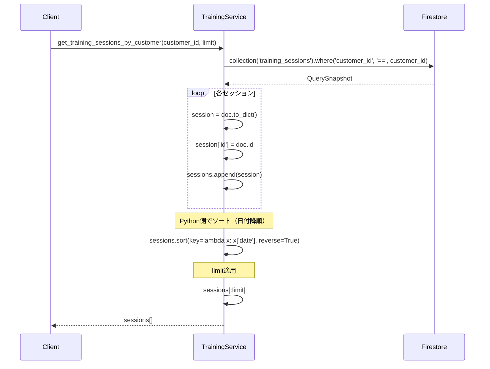
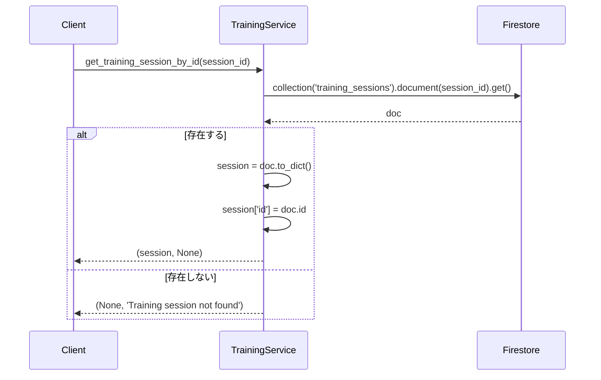
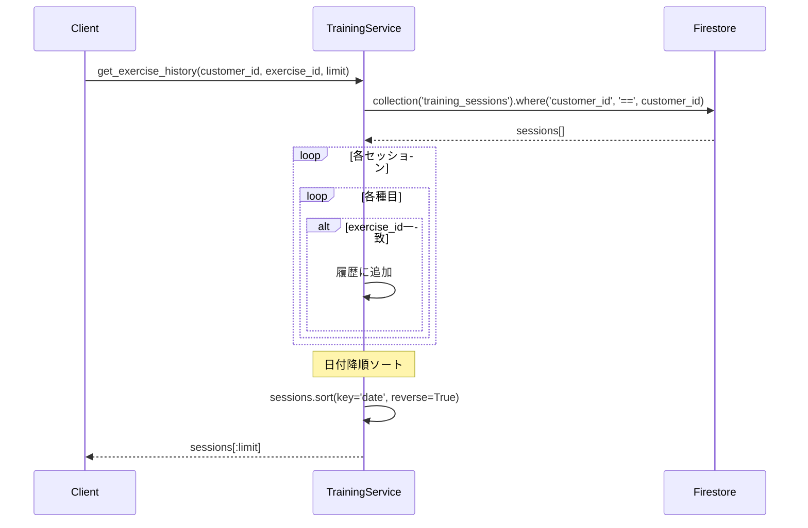
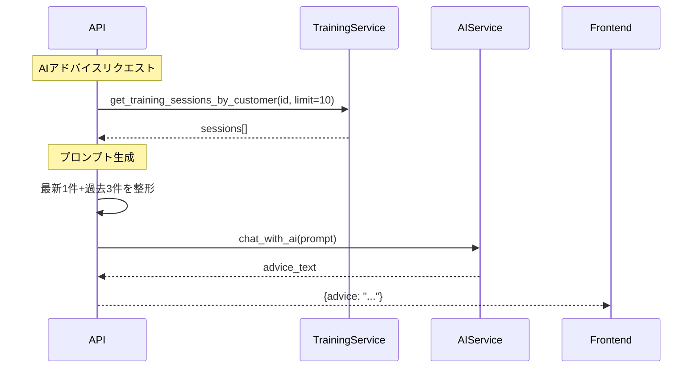

# 詳細設計書: TrainingService（トレーニング記録管理サービス）

**作成日**: 2026年1月4日  
**バージョン**: 1.0  
**担当**: MICHELAバックエンド

---

## 1. 概要

### 1.1 目的
顧客のトレーニング記録を管理し、進捗追跡と1RM（最大挙上重量）計算でパフォーマンス向上を支援する。

### 1.2 責務
- トレーニングセッション記録（日付・種目・セット数・重量）
- 種目プリセット管理（デフォルト15種目 + カスタム種目）
- 特定種目の履歴取得（進捗追跡）
- 1RM計算（Epley公式）
- AI連携データ提供（最新セッション + 過去3回）

### 1.3 特徴
- **デフォルトプリセット**: 主要15種目を内蔵（ベンチプレス、スクワット等）
- **カスタム種目**: ユーザー独自の種目を追加可能
- **Python側ソート**: 日付降順（Firestoreインデックス不要）
- **1RM計算**: Epley公式で最大挙上重量を推定

---

## 2. クラス図



---

## 3. データモデル

### 3.1 TrainingSession（トレーニングセッション）

| フィールド | 型 | 必須 | 説明 | 例 |
|-----------|-----|------|------|-----|
| id | string | ○ | 自動生成ID | "session_abc123" |
| customer_id | string | ○ | 顧客ID（外部キー） | "customer_xyz789" |
| date | string | ○ | トレーニング日（YYYY-MM-DD） | "2026-01-04" |
| exercises | array | ○ | 実施種目リスト（Exercise型） | 下記参照 |
| notes | string | - | メモ | "今日は調子が良かった" |
| duration_minutes | int | - | トレーニング時間（分） | 60 |
| created_at | string | ○ | 記録日時（ISO 8601） | "2026-01-04T10:00:00" |

**Firestoreパス**: `training_sessions/{session_id}`

### 3.2 Exercise（種目詳細）

| フィールド | 型 | 必須 | 説明 | 例 |
|-----------|-----|------|------|-----|
| exercise_id | string | ○ | 種目ID（ExercisePreset参照） | "bench_press" |
| exercise_name | string | ○ | 種目名（キャッシュ） | "ベンチプレス" |
| sets | array | ○ | セット詳細（Set型） | 下記参照 |

### 3.3 Set（セット詳細）

| フィールド | 型 | 必須 | 説明 | 例 |
|-----------|-----|------|------|-----|
| reps | int | ○ | 回数 | 10 |
| weight | float | ○ | 重量（kg）※0=自重 | 60.0 / 0 |

**TrainingSessionの具体例**:
```json
{
  "id": "session_001",
  "customer_id": "customer_123",
  "date": "2026-01-04",
  "exercises": [
    {
      "exercise_id": "bench_press",
      "exercise_name": "ベンチプレス",
      "sets": [
        {"reps": 10, "weight": 60.0},
        {"reps": 8, "weight": 65.0},
        {"reps": 6, "weight": 70.0}
      ]
    },
    {
      "exercise_id": "squat",
      "exercise_name": "スクワット",
      "sets": [
        {"reps": 12, "weight": 80.0},
        {"reps": 10, "weight": 85.0}
      ]
    }
  ],
  "notes": "調子良好",
  "duration_minutes": 60,
  "created_at": "2026-01-04T10:00:00"
}
```

### 3.4 ExercisePreset（種目プリセット）

| フィールド | 型 | 必須 | 説明 | 例 |
|-----------|-----|------|------|-----|
| id | string | ○ | 種目ID | "bench_press" / "custom_ex_001" |
| name | string | ○ | 種目名 | "ベンチプレス" |
| category | string | ○ | 部位 | "chest", "back", "legs", "shoulders", "arms" |
| unit | string | ○ | 単位 | "kg" / "回" |
| created_at | string | - | 作成日時（カスタム種目のみ） | "2026-01-04T10:00:00" |

**Firestoreパス（カスタム種目のみ）**: `exercise_presets/{exercise_id}`

**デフォルトプリセット（15種目）**:
```python
EXERCISE_PRESETS = [
    {"id": "bench_press", "name": "ベンチプレス", "category": "chest", "unit": "kg"},
    {"id": "squat", "name": "スクワット", "category": "legs", "unit": "kg"},
    {"id": "deadlift", "name": "デッドリフト", "category": "back", "unit": "kg"},
    {"id": "shoulder_press", "name": "ショルダープレス", "category": "shoulders", "unit": "kg"},
    {"id": "barbell_row", "name": "バーベルロウ", "category": "back", "unit": "kg"},
    {"id": "pull_up", "name": "懸垂", "category": "back", "unit": "回"},
    {"id": "dip", "name": "ディップス", "category": "chest", "unit": "回"},
    {"id": "lat_pulldown", "name": "ラットプルダウン", "category": "back", "unit": "kg"},
    {"id": "leg_press", "name": "レッグプレス", "category": "legs", "unit": "kg"},
    {"id": "leg_extension", "name": "レッグエクステンション", "category": "legs", "unit": "kg"},
    {"id": "leg_curl", "name": "レッグカール", "category": "legs", "unit": "kg"},
    {"id": "bicep_curl", "name": "バイセプスカール", "category": "arms", "unit": "kg"},
    {"id": "tricep_extension", "name": "トライセプスエクステンション", "category": "arms", "unit": "kg"},
    {"id": "cable_fly", "name": "ケーブルフライ", "category": "chest", "unit": "kg"},
    {"id": "side_raise", "name": "サイドレイズ", "category": "shoulders", "unit": "kg"}
]
```

---

## 4. メソッド仕様

### 4.1 get_exercise_presets() → list[dict]

**目的**: 種目プリセット一覧を取得（カスタム + デフォルト）

**返り値**: `list[dict]`
```python
[
    {"id": "custom_ex_001", "name": "カスタムベンチ", "category": "胸", "unit": "kg"},
    {"id": "bench_press", "name": "ベンチプレス", "category": "chest", "unit": "kg"},
    {"id": "squat", "name": "スクワット", "category": "legs", "unit": "kg"},
    # ... (カスタム優先でマージ、重複ID除外)
]
```

**処理フロー**:


**重複排除ロジック**:
```python
seen_ids = set()
unique_exercises = []
for ex in all_exercises:
    if ex['id'] not in seen_ids:
        seen_ids.add(ex['id'])
        unique_exercises.append(ex)
# 先に追加された方（カスタム）が優先される
```

**設計判断**:
- カスタム種目を先に追加 → 同じIDのデフォルトプリセットを上書き可能
- デフォルトプリセットは削除不可（EXERCISE_PRESETS定数）

---

### 4.2 add_exercise_preset(name: str, category: str = 'custom')

**目的**: カスタム種目を追加

**入力パラメータ**:
- `name` (str): 種目名
- `category` (str, default='custom'): 部位

**返り値**: `tuple[str | None, str | None]`
- 成功: `(exercise_id, None)`
- 失敗: `(None, error_message)`

**バリデーション**:
```python
# 1. 空文字チェック
if not name or not name.strip():
    return None, '種目名が必要です'

if not category or not category.strip():
    return None, '部位が必要です'

# 2. 重複チェック
existing = db.collection('exercise_presets').where('name', '==', name.strip()).limit(1).get()
if len(list(existing)) > 0:
    return None, '同じ名前の種目がすでに存在します'
```

**処理フロー**:


**作成データ**:
```python
{
    'name': name.strip(),
    'category': category.strip(),
    'unit': 'kg',  # 固定値
    'created_at': datetime.now().isoformat()
}
```

---

### 4.3 delete_exercise_preset(exercise_id: str)

**目的**: カスタム種目を削除（デフォルトプリセット保護）

**入力パラメータ**:
- `exercise_id` (str): 削除対象種目ID

**返り値**: `str | None`
- 成功: `None`
- 失敗: エラーメッセージ文字列

**デフォルトプリセット保護**:
```python
default_ids = [ex['id'] for ex in EXERCISE_PRESETS]
if exercise_id in default_ids:
    return 'デフォルト種目は削除できません'
```

**処理フロー**:


**推奨事項**:
- 削除前に使用中のセッションがないか確認
- カスケード削除または参照整合性チェック

---

### 4.4 add_training_session(data: dict)

**目的**: トレーニングセッションを記録

**入力パラメータ**:
- `data` (dict): セッションデータ
  - `customer_id` (str, 必須): 顧客ID
  - `date` (str, 必須): トレーニング日（YYYY-MM-DD）
  - `exercises` (array, 必須): 種目リスト
  - `notes` (str, optional): メモ
  - `duration_minutes` (int, optional): トレーニング時間

**返り値**: `tuple[str | None, str | None]`
- 成功: `(session_id, None)`
- 失敗: `(None, 'Missing required fields')`

**処理フロー**:


**セッションデータ構造**:
```python
{
    'customer_id': 'customer_123',
    'date': '2026-01-04',
    'exercises': [
        {
            'exercise_id': 'bench_press',
            'exercise_name': 'ベンチプレス',  # フロントエンドで設定
            'sets': [
                {'reps': 10, 'weight': 60.0},
                {'reps': 8, 'weight': 65.0}
            ]
        }
    ],
    'notes': 'メモ',
    'duration_minutes': 60,
    'created_at': '2026-01-04T10:00:00'  # サーバー側で自動設定
}
```

---

### 4.5 get_training_sessions_by_customer(customer_id: str, limit: int = 20)

**目的**: 顧客のトレーニングセッション一覧を取得

**入力パラメータ**:
- `customer_id` (str): 顧客ID
- `limit` (int, default=20): 取得件数上限

**返り値**: `list[dict]` - セッションリスト（日付降順）

**処理フロー**:


**設計判断**:
- Firestoreのorder_byを使わない（WeightServiceと同様）
- 理由: 複合インデックス不要でコスト削減

---

### 4.6 get_training_session_by_id(session_id: str)

**目的**: セッション詳細を取得

**返り値**: `tuple[dict | None, str | None]`
- 成功: `(session_data, None)`
- 失敗: `(None, 'Training session not found')`

**処理フロー**:


---

### 4.7 update_training_session(session_id: str, data: dict)

**目的**: セッション内容を更新

**入力パラメータ**:
- `session_id` (str): 更新対象ID
- `data` (dict): 更新データ（部分更新可能）

**返り値**: なし（void）

**処理**:
```python
db.collection('training_sessions').document(session_id).update(data)
```

**推奨改善**:
- エラーハンドリング追加（try-except）
- 返り値をNoneまたはエラーメッセージに統一

---

### 4.8 delete_training_session(session_id: str)

**目的**: セッションを削除

**処理**:
```python
db.collection('training_sessions').document(session_id).delete()
```

**推奨改善**:
- エラーハンドリング追加
- カスケード削除（関連データがある場合）

---

### 4.9 get_exercise_history(customer_id: str, exercise_id: str, limit: int = 10)

**目的**: 特定種目の履歴を取得（進捗追跡用）

**入力パラメータ**:
- `customer_id` (str): 顧客ID
- `exercise_id` (str): 種目ID
- `limit` (int, default=10): 取得件数上限

**返り値**: `list[dict]`
```python
[
    {
        "date": "2026-01-04",
        "exercise": {
            "exercise_id": "bench_press",
            "exercise_name": "ベンチプレス",
            "sets": [
                {"reps": 10, "weight": 60.0},
                {"reps": 8, "weight": 65.0}
            ]
        },
        "session_id": "session_001"
    },
    # ... (日付降順)
]
```

**処理フロー**:


**使用例**:
```python
# ベンチプレスの履歴を取得
history = training_service.get_exercise_history('customer_123', 'bench_press', limit=5)

for record in history:
    max_weight = max(s['weight'] for s in record['exercise']['sets'])
    print(f"{record['date']}: 最大重量 {max_weight}kg")
```

---

### 4.10 calculate_1rm(weight: float, reps: int) → float

**目的**: 1RM（最大挙上重量）を計算

**入力パラメータ**:
- `weight` (float): 挙上重量（kg）
- `reps` (int): 回数

**返り値**: `float` - 推定1RM（kg）

**Epley公式**:
```
1RM = weight × (1 + reps / 30)
```

**特殊ケース**:
```python
if reps == 1:
    return weight  # 1回の場合はそのまま1RM
```

**計算例**:
```python
# 60kg × 10回
calculate_1rm(60.0, 10)  # → 60 × (1 + 10/30) = 60 × 1.333 = 80.0kg

# 100kg × 5回
calculate_1rm(100.0, 5)  # → 100 × (1 + 5/30) = 100 × 1.167 = 116.7kg

# 80kg × 1回
calculate_1rm(80.0, 1)  # → 80.0kg（そのまま）
```

**他の公式との比較**:
- **Epley**: `weight × (1 + reps / 30)` - シンプル、高レップで過大評価
- **Brzycki**: `weight / (1.0278 - 0.0278 × reps)` - 中レップ（4-10回）で正確
- **Lombardi**: `weight × reps^0.1` - 低レップ（1-5回）で正確

**推奨**: 用途に応じて公式を選択可能にする

---

## 5. 使用例

### 5.1 トレーニング記録追加
```python
from app.services import training_service

session_data = {
    'customer_id': 'customer_123',
    'date': '2026-01-04',
    'exercises': [
        {
            'exercise_id': 'bench_press',
            'exercise_name': 'ベンチプレス',
            'sets': [
                {'reps': 10, 'weight': 60.0},
                {'reps': 8, 'weight': 65.0},
                {'reps': 6, 'weight': 70.0}
            ]
        }
    ],
    'notes': '調子良好',
    'duration_minutes': 60
}

session_id, error = training_service.add_training_session(session_data)
if error:
    print(f"エラー: {error}")
else:
    print(f"記録成功: {session_id}")
```

### 5.2 セッション一覧取得
```python
# 最新20件
sessions = training_service.get_training_sessions_by_customer('customer_123', limit=20)

for session in sessions:
    print(f"{session['date']}: {len(session['exercises'])}種目")
```

### 5.3 種目別進捗確認
```python
# ベンチプレスの履歴
history = training_service.get_exercise_history('customer_123', 'bench_press', limit=5)

for record in history:
    max_weight = max(s['weight'] for s in record['exercise']['sets'])
    max_set = max(record['exercise']['sets'], key=lambda s: s['weight'])
    
    # 1RM計算
    estimated_1rm = training_service.calculate_1rm(max_set['weight'], max_set['reps'])
    
    print(f"{record['date']}: 最大 {max_weight}kg × {max_set['reps']}回")
    print(f"  → 推定1RM: {estimated_1rm:.1f}kg")
```

**出力例**:
```
2026-01-04: 最大 70.0kg × 6回
  → 推定1RM: 84.0kg
2026-01-03: 最大 65.0kg × 8回
  → 推定1RM: 82.3kg
```

### 5.4 AI連携（最新+過去3回）
```python
# AIアドバイス用データ取得
sessions = training_service.get_training_sessions_by_customer('customer_123', limit=10)

latest_session = sessions[0] if sessions else None
past_sessions = sessions[1:4] if len(sessions) > 1 else []

# プロンプト生成
prompt = f"Today:\n{latest_session['date']}\n"
for ex in latest_session['exercises']:
    sets_text = ", ".join([f"{s['reps']}×{s['weight']}kg" for s in ex['sets']])
    prompt += f"- {ex['exercise_name']}: {sets_text}\n"

prompt += "\nPast 3 sessions:\n"
for session in past_sessions:
    # ... (過去の記録を追加)

# AIにプロンプト送信
```

---

## 6. エラーハンドリング戦略

### 6.1 必須フィールド不足
**状況**: `add_training_session()`で必須パラメータ欠損

**検出**:
```python
required = ['customer_id', 'date', 'exercises']
if not all(k in data for k in required):
    return None, 'Missing required fields'
```

**フロントエンド表示**:
```typescript
if (error === 'Missing required fields') {
    toast.error('必須項目が不足しています');
}
```

### 6.2 カスタム種目重複
**状況**: 同じ名前の種目を追加

**検出**:
```python
existing = db.collection('exercise_presets').where('name', '==', name.strip()).limit(1).get()
if len(list(existing)) > 0:
    return None, '同じ名前の種目がすでに存在します'
```

### 6.3 デフォルトプリセット削除試行
**状況**: デフォルト種目の削除を試行

**検出**:
```python
default_ids = [ex['id'] for ex in EXERCISE_PRESETS]
if exercise_id in default_ids:
    return 'デフォルト種目は削除できません'
```

---

## 7. パフォーマンス考慮事項

### 7.1 セッション取得の最適化

**現在の実装**:
```python
query = db.collection('training_sessions').where('customer_id', '==', customer_id)
# 全件取得 → Pythonでソート → [:limit]
```

**推奨改善**（セッション数 > 100の場合）:
```python
query = db.collection('training_sessions')\
          .where('customer_id', '==', customer_id)\
          .order_by('date', direction=firestore.Query.DESCENDING)\
          .limit(limit)
```

**必要な複合インデックス**:
```
Collection: training_sessions
Fields: customer_id (ASC), date (DESC)
```

### 7.2 種目履歴取得の効率化

**現状**: 全セッション取得 → 種目フィルタリング

**問題点**: 種目が含まれないセッションも取得してしまう

**推奨改善**:
- Firestoreの配列クエリ使用（`array-contains`）
- ただし、exercisesは複雑なオブジェクト配列なので要設計変更

---

## 8. セキュリティ考慮事項

### 8.1 顧客データアクセス制御
**リスク**: 他人のトレーニング記録を閲覧可能

**推奨対応**:
```python
def get_training_sessions_by_customer(customer_id, limit=20, requesting_user_id=None):
    # 権限チェック
    if requesting_user_id and not is_authorized(requesting_user_id, customer_id):
        raise PermissionError("Access denied")
    
    # ... 既存処理
```

### 8.2 データ整合性
**exercise_name のキャッシュ問題**:
- セッション記録時にexercise_nameをコピー
- プリセット名変更時、過去のセッションは更新されない

**推奨**: 表示時にプリセットから名前を再取得（オプション）

---

## 9. テスト戦略

### 9.1 単体テスト（実装済み）

| テストケース | 内容 | カバレッジ |
|-------------|------|-----------|
| `test_get_exercise_presets` | プリセット取得（カスタム+デフォルト） | ○ |
| `test_add_exercise_preset` | カスタム種目追加 | ○ |
| `test_add_training_session_success` | セッション記録成功 | ○ |
| `test_add_training_session_missing_fields` | 必須フィールド不足 | ○ |
| `test_get_training_sessions_by_customer` | セッション一覧取得 | ○ |
| `test_get_training_session_by_id` | セッション詳細取得 | ○ |
| `test_get_training_session_by_id_not_found` | 存在しないセッション | ○ |
| `test_update_training_session` | セッション更新 | ○ |
| `test_delete_training_session` | セッション削除 | ○ |
| `test_get_exercise_history` | 種目別履歴取得 | ○ |
| `test_calculate_1rm` | 1RM計算（10回） | ○ |
| `test_calculate_1rm_single_rep` | 1RM計算（1回） | ○ |
| `test_delete_default_exercise_preset` | デフォルト削除防止 | ○ |
| `test_add_exercise_preset_empty_name` | 空名前バリデーション | ○ |
| `test_add_training_session_error_handling` | 例外処理 | ○ |
| `test_get_training_session_by_id_error` | 例外処理 | ○ |
| `test_add_exercise_preset_duplicate_name` | 重複名前チェック | ○ |

**カバレッジ**: 74%（Branch Coverage）

**未カバー箇所**:
- `get_db()`関数本体
- `update_training_session()`のエラー処理
- `delete_training_session()`のエラー処理

---

## 10. 統合ポイント

### 10.1 AI Service連携



**プロンプト例**:
```
Today: 2026-01-04
- ベンチプレス: 10×60kg, 8×65kg, 6×70kg
- スクワット: 12×80kg, 10×85kg

Past 3 sessions:
2026-01-03: ベンチプレス 3sets, max 65kg
2026-01-02: スクワット 3sets, max 80kg
...

Context: Warmed up, trainer support, intermediate level, 0kg=bodyweight.
Compare with past 3 sessions, evaluate progress in 3 points, and advise for next session.
Please respond in Japanese.
```

---

## 11. 変更履歴

| 日付 | バージョン | 変更内容 | 担当 |
|------|-----------|---------|------|
| 2026-01-04 | 1.0 | 初版作成（Epley公式 + プリセット管理） | System |

---

## 12. 関連ドキュメント

- [Customer Service設計書](01_customer_service_design.md)（顧客管理）
- [AI Service設計書](05_ai_service_design.md)（AIアドバイス生成）
- [API設計書](../api/endpoints.md)（/add_training_session等）
- [フロントエンド: training/new/page.tsx](../../frontend/src/app/customer/[id]/training/new/page.tsx)（記録入力UI）
- [TrainingVolumeChart Component](../../frontend/src/components/TrainingVolumeChart.tsx)（グラフ表示）
