# 詳細設計書: MealService（食事記録・栄養管理サービス）

**作成日**: 2026年1月4日  
**バージョン**: 1.0  
**担当**: MICHELAバックエンド

---

## 1. 概要

### 1.1 目的
顧客の食事記録を管理し、カロリー・PFC（Protein/Fat/Carbs）バランスを追跡して栄養目標達成を支援する。

### 1.2 責務
- 食事記録管理（日付・食事タイプ・食品リスト）
- 自動PFC計算（カロリー・たんぱく質・脂質・炭水化物）
- 食品プリセット提供（23種類の一般食品）
- 1日の栄養素サマリー集計
- 栄養目標設定・取得（デフォルト値対応）
- AI連携データ提供（直近3日 + 7日平均）

### 1.3 特徴
- **食品プリセット23種**: タンパク質源・炭水化物源・野菜等
- **自動PFC計算**: 食品×数量で合計値を自動算出
- **デフォルト目標**: 未設定時は標準値（2000kcal/P150g/F60g/C200g）
- **Python側集計**: 日別サマリーはFirestoreではなくPythonで計算

---

## 2. クラス図

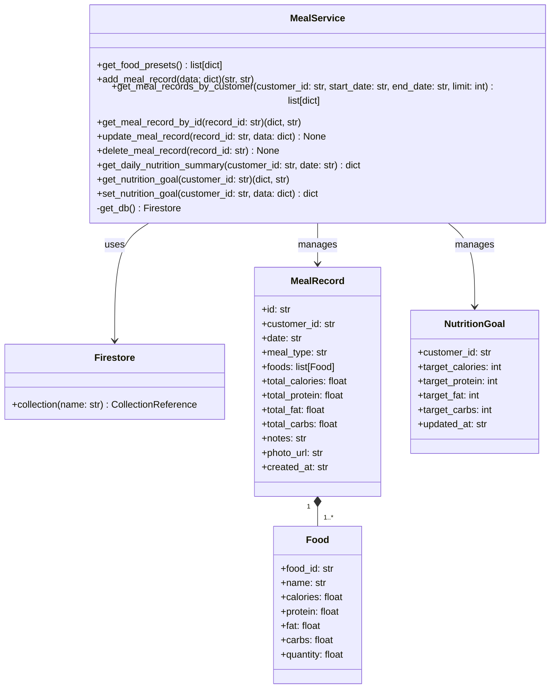

---

## 3. データモデル

### 3.1 MealRecord（食事記録）

| フィールド | 型 | 必須 | 説明 | 例 |
|-----------|-----|------|------|-----|
| id | string | ○ | 自動生成ID | "meal_abc123" |
| customer_id | string | ○ | 顧客ID（外部キー） | "customer_xyz789" |
| date | string | ○ | 食事日（YYYY-MM-DD） | "2026-01-04" |
| meal_type | string | ○ | 食事タイプ | "breakfast", "lunch", "dinner", "snack" |
| foods | array | ○ | 食品リスト（Food型） | 下記参照 |
| total_calories | float | ○ | 合計カロリー（kcal） | 650.5 |
| total_protein | float | ○ | 合計たんぱく質（g） | 45.2 |
| total_fat | float | ○ | 合計脂質（g） | 18.3 |
| total_carbs | float | ○ | 合計炭水化物（g） | 75.8 |
| notes | string | - | メモ | "朝食メニュー" |
| photo_url | string | - | 写真URL | "https://..." |
| created_at | string | ○ | 記録日時（ISO 8601） | "2026-01-04T08:30:00" |

**Firestoreパス**: `meal_records/{record_id}`

### 3.2 Food（食品詳細）

| フィールド | 型 | 必須 | 説明 | 例 |
|-----------|-----|------|------|-----|
| food_id | string | ○ | 食品ID（プリセット参照） | "chicken_breast" |
| name | string | ○ | 食品名（キャッシュ） | "鶏むね肉(100g)" |
| calories | float | ○ | 単位カロリー（kcal） | 108.0 |
| protein | float | ○ | 単位たんぱく質（g） | 22.3 |
| fat | float | ○ | 単位脂質（g） | 1.5 |
| carbs | float | ○ | 単位炭水化物（g） | 0.0 |
| quantity | float | ○ | 数量（倍率） | 2.0 (= 200g) |

**MealRecordの具体例**:
```json
{
  "id": "meal_001",
  "customer_id": "customer_123",
  "date": "2026-01-04",
  "meal_type": "breakfast",
  "foods": [
    {
      "food_id": "chicken_breast",
      "name": "鶏むね肉(100g)",
      "calories": 108.0,
      "protein": 22.3,
      "fat": 1.5,
      "carbs": 0.0,
      "quantity": 2.0
    },
    {
      "food_id": "white_rice",
      "name": "白米1膳(150g)",
      "calories": 252.0,
      "protein": 3.8,
      "fat": 0.5,
      "carbs": 55.7,
      "quantity": 1.0
    }
  ],
  "total_calories": 468.0,
  "total_protein": 48.4,
  "total_fat": 3.5,
  "total_carbs": 55.7,
  "notes": "朝食",
  "created_at": "2026-01-04T08:30:00"
}
```

### 3.3 NutritionGoal（栄養目標）

| フィールド | 型 | 必須 | 説明 | 例 |
|-----------|-----|------|------|-----|
| customer_id | string | ○ | 顧客ID（ドキュメントID） | "customer_123" |
| target_calories | int | ○ | 目標カロリー（kcal） | 2000 |
| target_protein | int | ○ | 目標たんぱく質（g） | 150 |
| target_fat | int | ○ | 目標脂質（g） | 60 |
| target_carbs | int | ○ | 目標炭水化物（g） | 200 |
| updated_at | string | ○ | 更新日時（ISO 8601） | "2026-01-04T10:00:00" |

**Firestoreパス**: `nutrition_goals/{customer_id}`

**デフォルト値（未設定時）**:
```python
{
    'customer_id': customer_id,
    'target_calories': 2000,
    'target_protein': 150,
    'target_fat': 60,
    'target_carbs': 200
}
```

### 3.4 FoodPreset（食品プリセット）

**定数定義（23種類）**:
```python
FOOD_PRESETS = [
    # タンパク質源（9種）
    {"id": "chicken_breast", "name": "鶏むね肉(100g)", "calories": 108, "protein": 22.3, "fat": 1.5, "carbs": 0},
    {"id": "chicken_thigh", "name": "鶏もも肉(100g)", "calories": 200, "protein": 16.2, "fat": 14.0, "carbs": 0},
    {"id": "beef", "name": "牛肉(100g)", "calories": 250, "protein": 17.1, "fat": 19.5, "carbs": 0.5},
    {"id": "pork", "name": "豚肉(100g)", "calories": 263, "protein": 17.1, "fat": 21.1, "carbs": 0.2},
    {"id": "salmon", "name": "サーモン(100g)", "calories": 133, "protein": 20.0, "fat": 5.5, "carbs": 0.1},
    {"id": "tuna", "name": "マグロ(100g)", "calories": 125, "protein": 26.4, "fat": 1.4, "carbs": 0.1},
    {"id": "egg", "name": "卵1個(60g)", "calories": 91, "protein": 7.4, "fat": 6.2, "carbs": 0.2},
    {"id": "tofu", "name": "豆腐(100g)", "calories": 72, "protein": 6.6, "fat": 4.2, "carbs": 1.6},
    {"id": "natto", "name": "納豆1パック(50g)", "calories": 100, "protein": 8.3, "fat": 5.0, "carbs": 6.1},
    
    # 炭水化物源（7種）
    {"id": "white_rice", "name": "白米1膳(150g)", "calories": 252, "protein": 3.8, "fat": 0.5, "carbs": 55.7},
    {"id": "brown_rice", "name": "玄米1膳(150g)", "calories": 248, "protein": 4.2, "fat": 1.5, "carbs": 51.3},
    {"id": "oatmeal", "name": "オートミール(50g)", "calories": 190, "protein": 6.9, "fat": 2.8, "carbs": 34.6},
    {"id": "bread", "name": "食パン1枚(60g)", "calories": 158, "protein": 5.6, "fat": 2.6, "carbs": 28.0},
    {"id": "pasta", "name": "パスタ(100g茹で)", "calories": 150, "protein": 5.2, "fat": 0.9, "carbs": 31.3},
    {"id": "sweet_potato", "name": "さつまいも(100g)", "calories": 132, "protein": 1.2, "fat": 0.2, "carbs": 31.5},
    {"id": "banana", "name": "バナナ1本(100g)", "calories": 86, "protein": 1.1, "fat": 0.2, "carbs": 22.5},
    
    # 野菜（4種）
    {"id": "broccoli", "name": "ブロッコリー(100g)", "calories": 33, "protein": 4.3, "fat": 0.5, "carbs": 5.2},
    {"id": "spinach", "name": "ほうれん草(100g)", "calories": 20, "protein": 2.2, "fat": 0.4, "carbs": 3.1},
    {"id": "tomato", "name": "トマト1個(150g)", "calories": 29, "protein": 1.1, "fat": 0.2, "carbs": 5.6},
    {"id": "avocado", "name": "アボカド1/2個(60g)", "calories": 112, "protein": 1.5, "fat": 11.2, "carbs": 3.8},
    
    # その他（3種）
    {"id": "olive_oil", "name": "オリーブオイル(大さじ1)", "calories": 111, "protein": 0, "fat": 12.6, "carbs": 0},
    {"id": "nuts", "name": "ミックスナッツ(30g)", "calories": 182, "protein": 5.4, "fat": 16.2, "carbs": 5.7},
    {"id": "protein_powder", "name": "プロテイン1杯(30g)", "calories": 116, "protein": 24.0, "fat": 1.2, "carbs": 3.6}
]
```

---

## 4. メソッド仕様

### 4.1 get_food_presets() → list[dict]

**目的**: 食品プリセット一覧を取得

**返り値**: `list[dict]` - FOOD_PRESETS定数をそのまま返却

**処理フロー**:
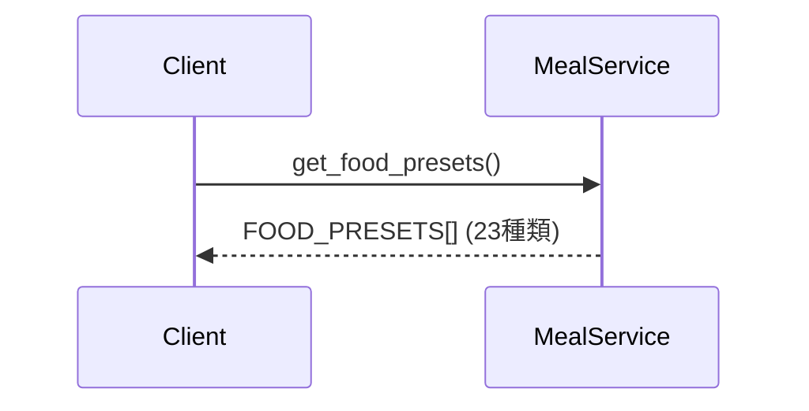

**特徴**:
- Firestore不使用（定数から直接返却）
- カスタム食品機能は未実装

---

### 4.2 add_meal_record(data: dict)

**目的**: 食事記録を追加（PFC自動計算）

**入力パラメータ**:
- `data` (dict): 食事記録データ
  - `customer_id` (str, 必須): 顧客ID
  - `date` (str, 必須): 食事日（YYYY-MM-DD）
  - `meal_type` (str, 必須): 食事タイプ
  - `foods` (array, 必須): 食品リスト
  - `notes` (str, optional): メモ
  - `photo_url` (str, optional): 写真URL

**返り値**: `tuple[str | None, str | None]`
- 成功: `(record_id, None)`
- 失敗: `(None, 'Missing required fields')`

**処理フロー**:
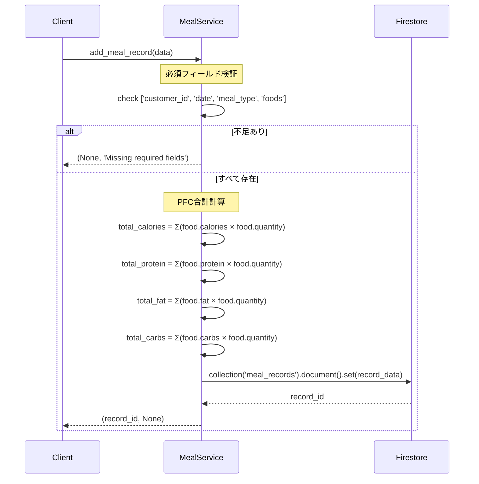

**PFC計算ロジック**:
```python
total_calories = sum(food.get('calories', 0) * food.get('quantity', 1) for food in data['foods'])
total_protein = sum(food.get('protein', 0) * food.get('quantity', 1) for food in data['foods'])
total_fat = sum(food.get('fat', 0) * food.get('quantity', 1) for food in data['foods'])
total_carbs = sum(food.get('carbs', 0) * food.get('quantity', 1) for food in data['foods'])
```

**計算例**:
```python
foods = [
    {"calories": 108, "protein": 22.3, "fat": 1.5, "carbs": 0, "quantity": 2.0},  # 鶏むね肉×2
    {"calories": 252, "protein": 3.8, "fat": 0.5, "carbs": 55.7, "quantity": 1.0}  # 白米×1
]

# 合計
total_calories = 108*2 + 252*1 = 468.0
total_protein = 22.3*2 + 3.8*1 = 48.4
total_fat = 1.5*2 + 0.5*1 = 3.5
total_carbs = 0*2 + 55.7*1 = 55.7
```

---

### 4.3 get_meal_records_by_customer(customer_id: str, start_date: str = None, end_date: str = None, limit: int = 30)

**目的**: 顧客の食事記録一覧を取得（日付範囲フィルタ対応）

**入力パラメータ**:
- `customer_id` (str): 顧客ID
- `start_date` (str, optional): 開始日（YYYY-MM-DD）
- `end_date` (str, optional): 終了日（YYYY-MM-DD）
- `limit` (int, default=30): 取得件数上限

**返り値**: `list[dict]` - 食事記録リスト（日付降順）

**処理フロー**:
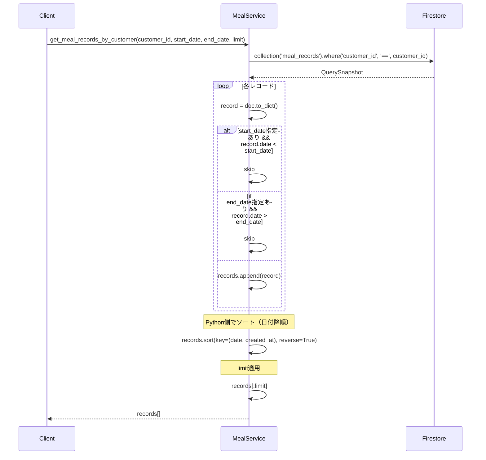

**設計判断**:
- 日付範囲フィルタ: Pythonで実施（Firestore複合インデックス不要）
- ソート順: `(date, created_at)`のタプルで同日内の順序も保証

---

### 4.4 get_meal_record_by_id(record_id: str)

**目的**: 食事記録詳細を取得

**返り値**: `tuple[dict | None, str | None]`
- 成功: `(record_data, None)`
- 失敗: `(None, 'Meal record not found')`

**処理フロー**:
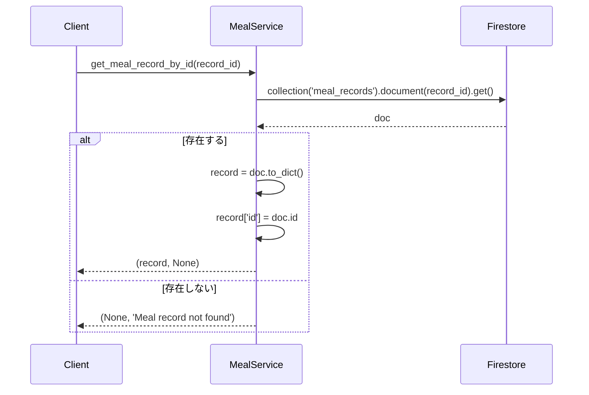

---

### 4.5 update_meal_record(record_id: str, data: dict)

**目的**: 食事記録を更新（PFC再計算）

**入力パラメータ**:
- `record_id` (str): 更新対象ID
- `data` (dict): 更新データ（部分更新可能）

**返り値**: なし（void）

**処理フロー**:
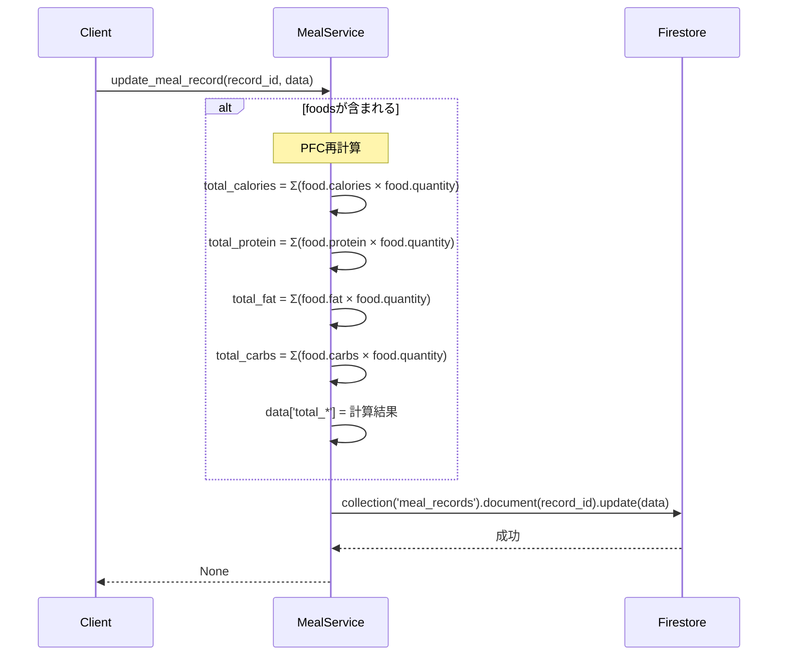

**自動再計算の例**:
```python
# foodsを更新
update_meal_record('meal_001', {
    'foods': [
        {"calories": 108, "protein": 22.3, "quantity": 3.0}  # 数量変更
    ]
})
# → total_calories等が自動再計算される
```

---

### 4.6 delete_meal_record(record_id: str)

**目的**: 食事記録を削除

**処理**:
```python
db.collection('meal_records').document(record_id).delete()
```

**推奨改善**:
- エラーハンドリング追加（try-except）
- 返り値をNoneまたはエラーメッセージに統一

---

### 4.7 get_daily_nutrition_summary(customer_id: str, date: str) → dict

**目的**: 1日の栄養素サマリーを集計

**入力パラメータ**:
- `customer_id` (str): 顧客ID
- `date` (str): 集計日（YYYY-MM-DD）

**返り値**: `dict`
```python
{
    'date': '2026-01-04',
    'total_calories': 1850.5,
    'total_protein': 142.3,
    'total_fat': 55.8,
    'total_carbs': 185.6,
    'meal_count': 4
}
```

**処理フロー**:
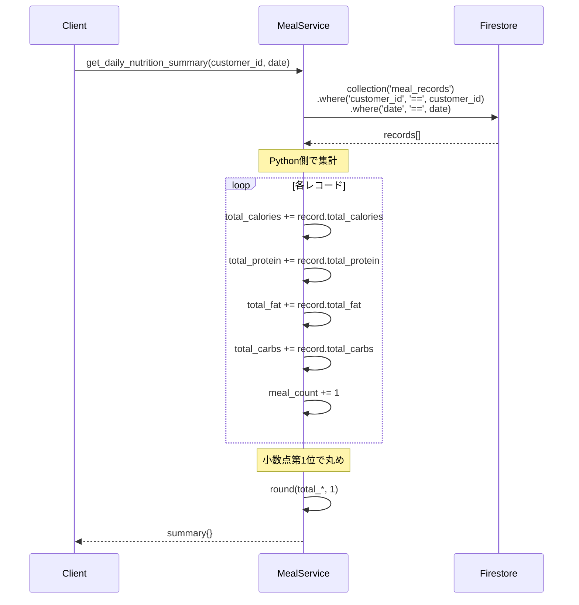

**使用例**:
```python
# 2026-01-04の栄養サマリー
summary = meal_service.get_daily_nutrition_summary('customer_123', '2026-01-04')

print(f"摂取カロリー: {summary['total_calories']}kcal")
print(f"たんぱく質: {summary['total_protein']}g")
print(f"食事回数: {summary['meal_count']}回")
```

---

### 4.8 get_nutrition_goal(customer_id: str)

**目的**: 栄養目標を取得（デフォルト値対応）

**返り値**: `tuple[dict, str | None]`
- 成功: `(goal_data, None)`
- 失敗: `(None, error_message)`

**処理フロー**:
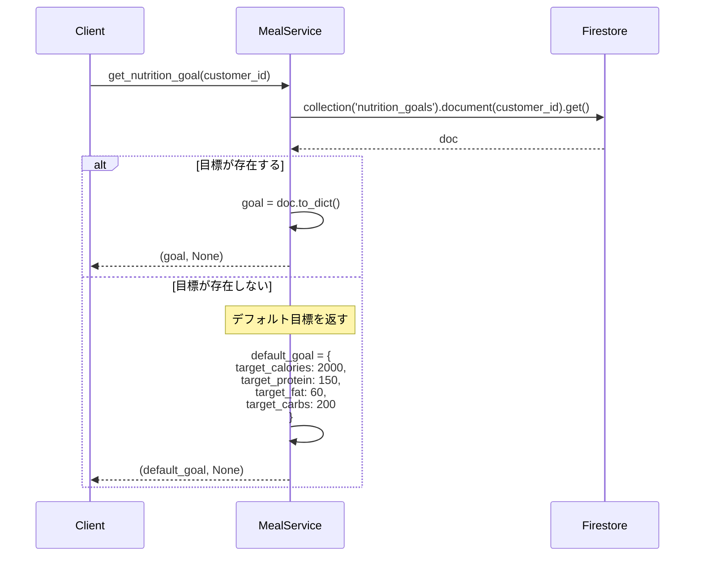

**デフォルト値の根拠**:
- **2000kcal**: 成人男性の平均的な維持カロリー
- **P150g**: 体重75kg × 2g/kg（筋トレ推奨）
- **F60g**: 総カロリーの27%（健康的な範囲）
- **C200g**: 残りを炭水化物で調整

**推奨改善**:
- 顧客の体重・身長・活動量から目標を自動計算
- Harris-Benedict式やTDEE計算の統合

---

### 4.9 set_nutrition_goal(customer_id: str, data: dict) → dict

**目的**: 栄養目標を設定

**入力パラメータ**:
- `customer_id` (str): 顧客ID
- `data` (dict): 目標データ
  - `target_calories` (int, optional): 目標カロリー
  - `target_protein` (int, optional): 目標たんぱく質
  - `target_fat` (int, optional): 目標脂質
  - `target_carbs` (int, optional): 目標炭水化物

**返り値**: `dict` - 設定した目標データ

**処理フロー**:
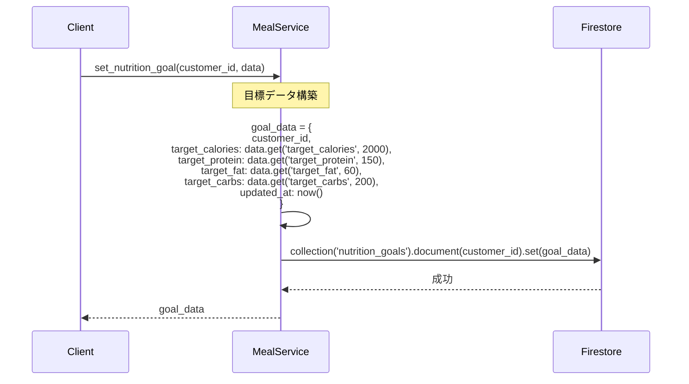

**Firestoreの.set()動作**:
- ドキュメントが存在しない: 新規作成
- ドキュメントが存在する: 上書き（完全置換）

**部分更新が必要な場合**:
```python
doc_ref.update(goal_data)  # .set()ではなく.update()
```

---

## 5. 使用例

### 5.1 食事記録追加
```python
from app.services import meal_service

meal_data = {
    'customer_id': 'customer_123',
    'date': '2026-01-04',
    'meal_type': 'breakfast',
    'foods': [
        {
            'food_id': 'chicken_breast',
            'name': '鶏むね肉(100g)',
            'calories': 108,
            'protein': 22.3,
            'fat': 1.5,
            'carbs': 0,
            'quantity': 2.0
        },
        {
            'food_id': 'white_rice',
            'name': '白米1膳(150g)',
            'calories': 252,
            'protein': 3.8,
            'fat': 0.5,
            'carbs': 55.7,
            'quantity': 1.0
        }
    ],
    'notes': '朝食'
}

record_id, error = meal_service.add_meal_record(meal_data)
if error:
    print(f"エラー: {error}")
else:
    print(f"記録成功: {record_id}")
    # 自動計算された値がFirestoreに保存される
```

### 5.2 1日のサマリー取得
```python
# 2026-01-04の栄養サマリー
summary = meal_service.get_daily_nutrition_summary('customer_123', '2026-01-04')

print(f"【{summary['date']}の栄養サマリー】")
print(f"摂取カロリー: {summary['total_calories']}kcal")
print(f"たんぱく質: {summary['total_protein']}g")
print(f"脂質: {summary['total_fat']}g")
print(f"炭水化物: {summary['total_carbs']}g")
print(f"食事回数: {summary['meal_count']}回")
```

**出力例**:
```
【2026-01-04の栄養サマリー】
摂取カロリー: 1850.5kcal
たんぱく質: 142.3g
脂質: 55.8g
炭水化物: 185.6g
食事回数: 4回
```

### 5.3 目標設定と達成率計算
```python
# 目標設定
goal_data = {
    'target_calories': 2200,
    'target_protein': 160,
    'target_fat': 70,
    'target_carbs': 220
}
meal_service.set_nutrition_goal('customer_123', goal_data)

# 目標取得
goal, _ = meal_service.get_nutrition_goal('customer_123')

# 今日のサマリー
summary = meal_service.get_daily_nutrition_summary('customer_123', '2026-01-04')

# 達成率計算
calorie_rate = (summary['total_calories'] / goal['target_calories']) * 100
protein_rate = (summary['total_protein'] / goal['target_protein']) * 100

print(f"カロリー達成率: {calorie_rate:.1f}%")
print(f"たんぱく質達成率: {protein_rate:.1f}%")
```

**出力例**:
```
カロリー達成率: 84.1%
たんぱく質達成率: 88.9%
```

### 5.4 AI連携（直近3日+7日平均）
```python
from collections import defaultdict
from datetime import datetime, timedelta

# 最新30件取得
records = meal_service.get_meal_records_by_customer('customer_123', limit=30)

# 日別集計
daily_nutrition = defaultdict(lambda: {'calories': 0, 'protein': 0, 'fat': 0, 'carbs': 0})
for record in records:
    date = record.get('date', '')
    daily_nutrition[date]['calories'] += record.get('total_calories', 0)
    daily_nutrition[date]['protein'] += record.get('total_protein', 0)
    daily_nutrition[date]['fat'] += record.get('total_fat', 0)
    daily_nutrition[date]['carbs'] += record.get('total_carbs', 0)

# 直近7日分
sorted_dates = sorted(daily_nutrition.keys(), reverse=True)[:7]

# 直近3日分の詳細
recent_summary = "【直近3日】\n"
for date in sorted_dates[:3]:
    day_data = daily_nutrition[date]
    recent_summary += f"{date}: {round(day_data['calories'])}kcal (P{round(day_data['protein'])}g/F{round(day_data['fat'])}g/C{round(day_data['carbs'])}g)\n"

# 7日平均
total_days = len(sorted_dates)
avg_calories = sum(daily_nutrition[d]['calories'] for d in sorted_dates) / total_days
avg_protein = sum(daily_nutrition[d]['protein'] for d in sorted_dates) / total_days

avg_summary = f"\n【7日平均】\n{round(avg_calories)}kcal (P{round(avg_protein)}g/...)\n"

# AIプロンプト生成
prompt = f"{recent_summary}{avg_summary}\n【目標】\n2200kcal (P160g/F70g/C220g)\n\n前提：目標値設定済。\n直近3日と平均を踏まえ、目標達成度とPFCバランスの総評3点。"
```

---

## 6. エラーハンドリング戦略

### 6.1 必須フィールド不足
**状況**: `add_meal_record()`で必須パラメータ欠損

**検出**:
```python
required = ['customer_id', 'date', 'meal_type', 'foods']
if not all(k in data for k in required):
    return None, 'Missing required fields'
```

### 6.2 空のfoodsリスト
**状況**: `foods: []`で記録追加

**現状**: エラーにならないが、total_*が0になる

**推奨対応**:
```python
if not data['foods']:
    return None, 'At least one food item is required'
```

### 6.3 栄養目標の不正な値
**状況**: 負の値や異常値（例: 0kcal, 10000kcal）

**推奨対応**:
```python
if not (500 <= data.get('target_calories', 2000) <= 5000):
    return None, 'Invalid calorie target (must be 500-5000kcal)'
```

---

## 7. パフォーマンス考慮事項

### 7.1 日別サマリーのキャッシュ

**現状**: 毎回Firestoreクエリ + Python集計

**推奨改善**（頻繁にアクセスする場合）:
```python
# サマリーを事前計算してキャッシュ
daily_summary = {
    'date': '2026-01-04',
    'total_calories': 1850.5,
    'total_protein': 142.3,
    'total_fat': 55.8,
    'total_carbs': 185.6,
    'meal_count': 4
}
db.collection('daily_nutrition_cache').document(f"{customer_id}_{date}").set(daily_summary)
```

### 7.2 日付範囲クエリの最適化

**現在の実装**: 全レコード取得 → Pythonフィルタ

**推奨改善**（レコード数 > 100の場合）:
```python
query = db.collection('meal_records')\
          .where('customer_id', '==', customer_id)\
          .where('date', '>=', start_date)\
          .where('date', '<=', end_date)
```

**必要な複合インデックス**:
```
Collection: meal_records
Fields: customer_id (ASC), date (ASC)
```

---

## 8. セキュリティ考慮事項

### 8.1 顧客データアクセス制御
**リスク**: 他人の食事記録を閲覧可能

**推奨対応**:
```python
def get_meal_records_by_customer(customer_id, start_date=None, end_date=None, limit=30, requesting_user_id=None):
    if requesting_user_id and not is_authorized(requesting_user_id, customer_id):
        raise PermissionError("Access denied")
    
    # ... 既存処理
```

### 8.2 入力値のサニタイゼーション
**リスク**: XSS攻撃（notes, photo_urlに悪意あるスクリプト）

**推奨対応**:
```python
import html

data['notes'] = html.escape(data.get('notes', ''))
```

---

## 9. テスト戦略

### 9.1 単体テスト（実装済み）

| テストケース | 内容 | カバレッジ |
|-------------|------|-----------|
| `test_get_food_presets` | プリセット一覧取得（23種） | ○ |
| `test_add_meal_record_success` | 食事記録追加成功 | ○ |
| `test_add_meal_record_missing_fields` | 必須フィールド不足 | ○ |
| `test_get_meal_records_by_customer` | 食事記録一覧取得 | ○ |
| `test_get_meal_records_with_date_range` | 日付範囲フィルタ | ○ |
| `test_get_meal_record_by_id` | 食事記録詳細取得 | ○ |
| `test_get_meal_record_by_id_not_found` | 存在しない記録 | ○ |
| `test_update_meal_record` | 食事記録更新 | ○ |
| `test_update_meal_record_recalculates_totals` | PFC再計算 | ○ |
| `test_delete_meal_record` | 食事記録削除 | ○ |
| `test_get_daily_nutrition_summary` | 日別サマリー集計 | ○ |
| `test_get_nutrition_goal_exists` | 栄養目標取得（存在） | ○ |
| `test_get_nutrition_goal_not_found` | デフォルト目標返却 | ○ |
| `test_set_nutrition_goal` | 栄養目標設定 | ○ |
| `test_add_meal_record_error_handling` | 例外処理 | ○ |
| `test_get_nutrition_goal_error_handling` | 例外処理 | ○ |
| `test_get_meal_records_by_customer_sorting` | ソート順確認 | ○ |

**カバレッジ**: 77%（Branch Coverage）

**未カバー箇所**:
- `get_db()`関数本体
- `update_meal_record()`のエラー処理
- `delete_meal_record()`のエラー処理

---

## 10. 統合ポイント

### 10.1 AI Service連携

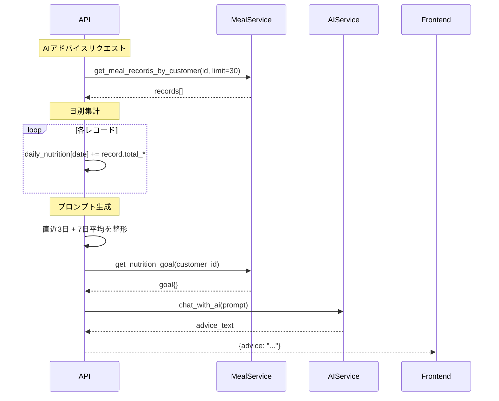

### 10.2 Dashboard連携

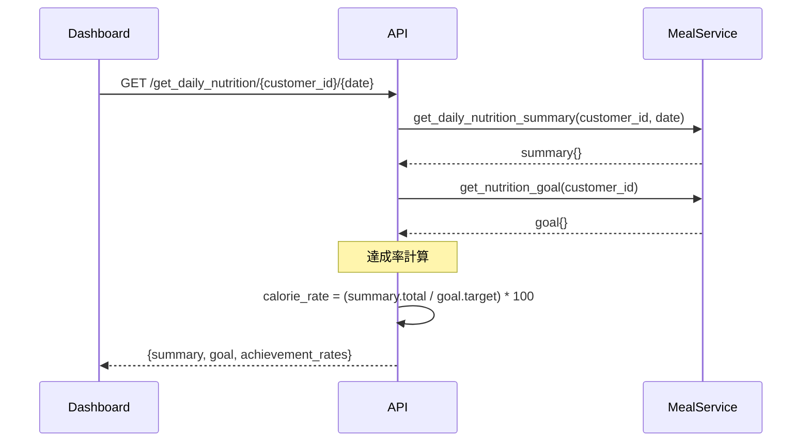

---

## 11. 変更履歴

| 日付 | バージョン | 変更内容 | 担当 |
|------|-----------|---------|------|
| 2026-01-04 | 1.0 | 初版作成（PFC自動計算 + デフォルト目標） | System |

---

## 12. 関連ドキュメント

- [Customer Service設計書](01_customer_service_design.md)（顧客管理）
- [AI Service設計書](05_ai_service_design.md)（AIアドバイス生成）
- [API設計書](../api/endpoints.md)（/add_meal_record等）
- [フロントエンド: meal/new/page.tsx](../../frontend/src/app/customer/[id]/meal/new/page.tsx)（記録入力UI）
- [NutritionChart Component](../../frontend/src/components/NutritionChart.tsx)（PFCグラフ表示）
