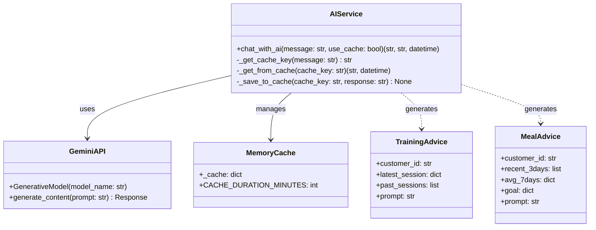
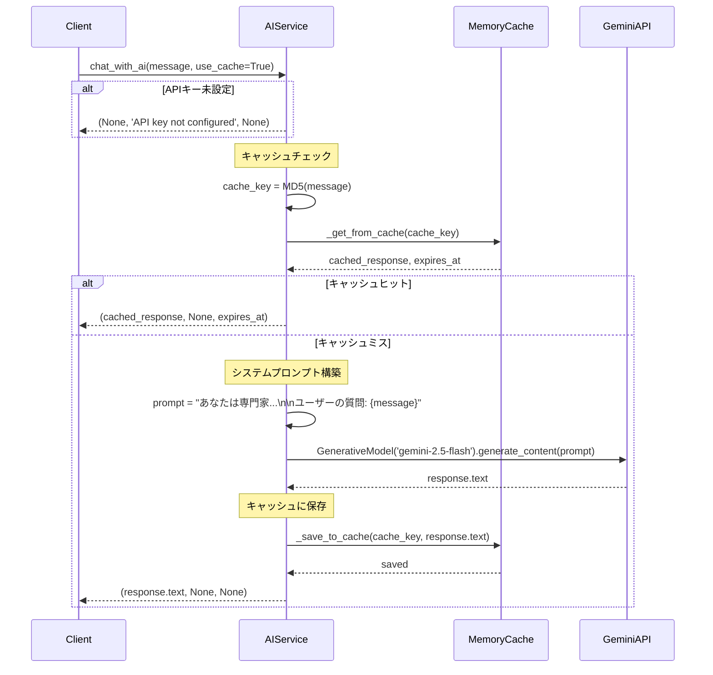
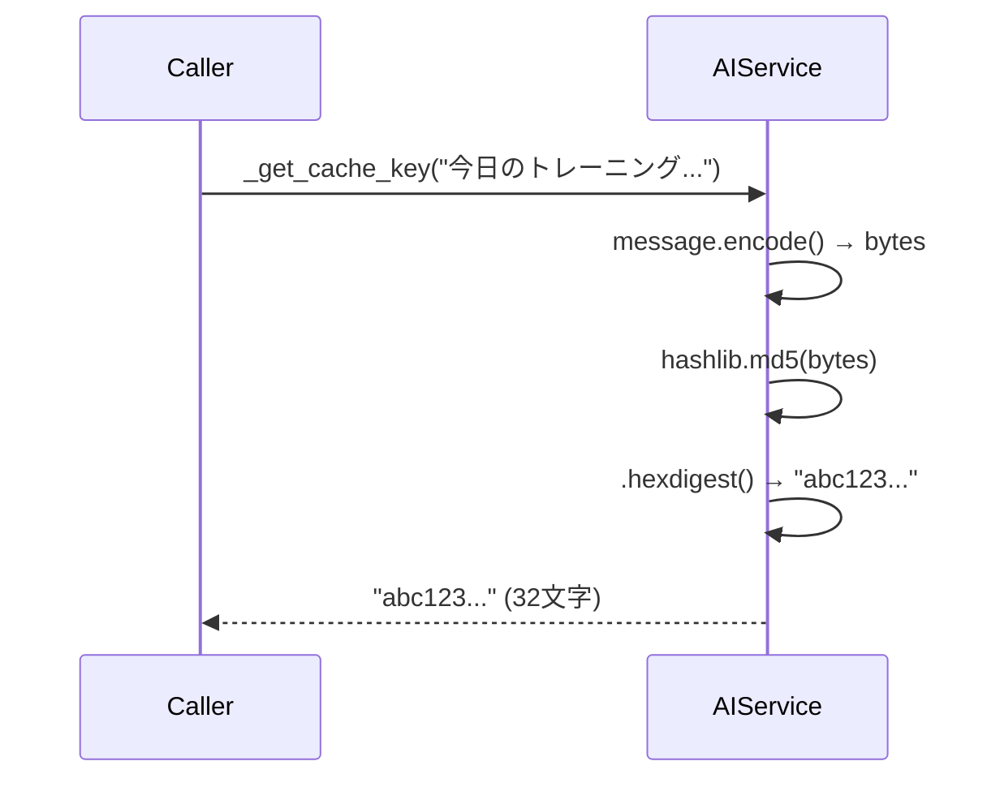
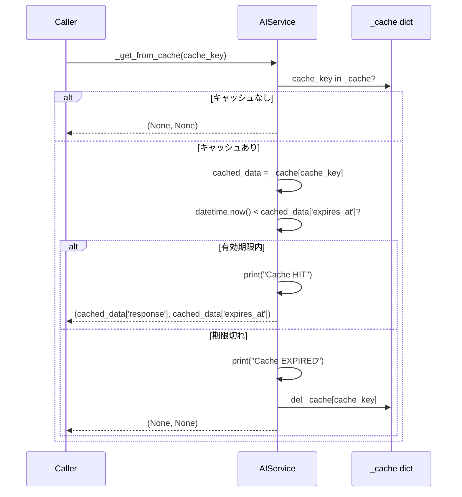
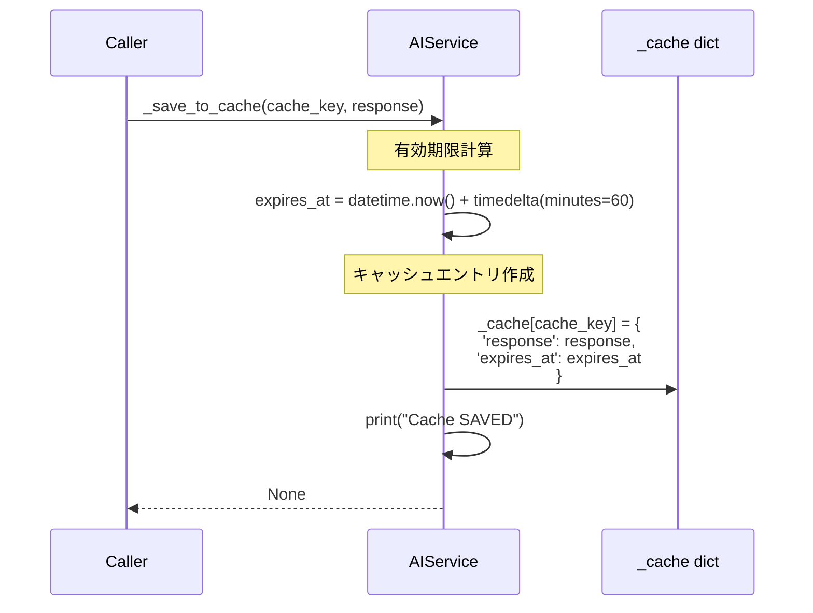
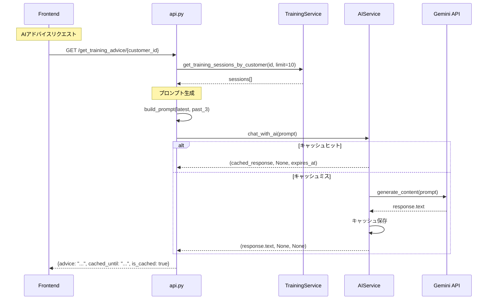
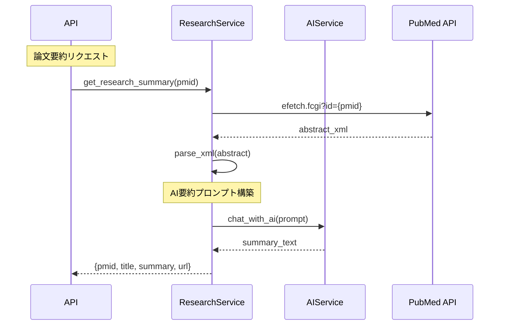

# 詳細設計書: AIService（Gemini API統合サービス）

**作成日**: 2026年1月4日  
**バージョン**: 1.0  
**担当**: MICHELAバックエンド

---

## 1. 概要

### 1.1 目的
Google Gemini APIを統合し、トレーニング・食事アドバイスと研究論文要約をAI生成で提供する。

### 1.2 責務
- Gemini APIとの通信（gemini-2.5-flashモデル）
- プロンプトエンジニアリング（システムプロンプト追加）
- レスポンスキャッシュ（MD5ハッシュ + 60分TTL）
- エラーハンドリング（APIキー未設定、API障害）
- トレーニング・食事アドバイス生成
- 研究論文要約生成

### 1.3 特徴
- **MD5キャッシュ**: 同じプロンプトは60分間再利用
- **メモリキャッシュ**: アプリケーション内蔵（Redis不使用）
- **キャッシュヒット情報**: レスポンスに有効期限を含む
- **専門家プロンプト**: "筋トレ・ダイエット・栄養科学の専門家"として回答

---

## 2. クラス図



---

## 3. データモデル

### 3.1 CacheEntry（キャッシュエントリ）

| フィールド | 型 | 説明 | 例 |
|-----------|-----|------|-----|
| cache_key | string | MD5ハッシュ（32文字） | "5d41402abc4b2a76b9719d911017c592" |
| response | string | AI応答テキスト | "筋肥大には..." |
| expires_at | datetime | キャッシュ有効期限 | datetime(2026, 1, 4, 11, 30, 0) |

**メモリ構造**:
```python
_cache = {
    "5d41402abc...": {
        "response": "筋肥大には1日あたり体重1kgあたり1.6gのタンパク質摂取が効果的です...",
        "expires_at": datetime(2026, 1, 4, 11, 30, 0)
    },
    "098f6bcd46...": {
        "response": "トレーニング頻度は週3-4回が最適です...",
        "expires_at": datetime(2026, 1, 4, 12, 0, 0)
    }
}
```

### 3.2 AIResponse（AI応答）

| フィールド | 型 | 説明 | 例 |
|-----------|-----|------|-----|
| response_text | string | AI生成テキスト | "今回のトレーニング..." |
| error | string | エラーメッセージ | None / "API Error" |
| cached_until | datetime | キャッシュ有効期限（キャッシュヒット時のみ） | datetime(...) / None |

**返り値の型**:
```python
tuple[str | None, str | None, datetime | None]
```

---

## 4. メソッド仕様

### 4.1 chat_with_ai(message: str, use_cache: bool = True)

**目的**: Gemini AIにプロンプトを送信して応答を取得

**入力パラメータ**:
- `message` (str): ユーザーの質問またはプロンプト
- `use_cache` (bool, default=True): キャッシュ使用の有無

**返り値**: `tuple[str | None, str | None, datetime | None]`
- 成功（キャッシュミス）: `(response_text, None, None)`
- 成功（キャッシュヒット）: `(response_text, None, expires_at)`
- 失敗: `(None, error_message, None)`

**処理フロー**:


**システムプロンプト**:
```python
prompt = f"""あなたは筋トレ・ダイエット・栄養科学の専門家アシスタントです。
科学的根拠に基づいた最新の情報を提供してください。
可能な限り具体的な研究や論文を参照してください。

ユーザーの質問: {message}"""
```

**エラーケース**:
```python
# 1. APIキー未設定
if not GEMINI_API_KEY:
    return None, 'Gemini API key not configured. Please set GEMINI_API_KEY environment variable.', None

# 2. API例外
except Exception as e:
    return None, str(e), None
```

---

### 4.2 _get_cache_key(message: str) → str

**目的**: プロンプトからMD5ハッシュを生成

**入力パラメータ**:
- `message` (str): プロンプト文字列

**返り値**: `str` - 32文字のMD5ハッシュ（16進数）

**アルゴリズム**:
```python
import hashlib

cache_key = hashlib.md5(message.encode()).hexdigest()
# 例: "hello" → "5d41402abc4b2a76b9719d911017c592"
```

**処理フロー**:


**特性**:
- **決定性**: 同じ入力は常に同じハッシュ
- **高速**: MD5はSHA-256より高速（セキュリティ不要なので問題なし）
- **固定長**: 入力長に関わらず32文字

**使用例**:
```python
key1 = _get_cache_key("筋肥大に最適なタンパク質量は？")
key2 = _get_cache_key("筋肥大に最適なタンパク質量は？")
key3 = _get_cache_key("筋肥大に最適なタンパク質量は？ ")  # 末尾スペース

assert key1 == key2  # True（同じ入力）
assert key1 != key3  # True（異なる入力）
```

---

### 4.3 _get_from_cache(cache_key: str) → tuple[str | None, datetime | None]

**目的**: キャッシュからレスポンスを取得（有効期限チェック付き）

**入力パラメータ**:
- `cache_key` (str): MD5ハッシュ

**返り値**: `tuple[str | None, datetime | None]`
- キャッシュヒット（有効）: `(response, expires_at)`
- キャッシュミス: `(None, None)`
- キャッシュ期限切れ: `(None, None)` + キャッシュエントリ削除

**処理フロー**:


**ログ出力**:
```python
# キャッシュヒット
print(f"Cache HIT: {cache_key[:10]}...")
# 出力例: Cache HIT: 5d41402abc...

# キャッシュ期限切れ
print(f"Cache EXPIRED: {cache_key[:10]}...")
# 出力例: Cache EXPIRED: 098f6bcd46...
```

---

### 4.4 _save_to_cache(cache_key: str, response: str)

**目的**: レスポンスをキャッシュに保存（60分TTL）

**入力パラメータ**:
- `cache_key` (str): MD5ハッシュ
- `response` (str): AI応答テキスト

**返り値**: なし（void）

**処理フロー**:


**キャッシュエントリ構造**:
```python
_cache[cache_key] = {
    'response': "筋肥大には1日あたり体重1kgあたり1.6gのタンパク質摂取が効果的です...",
    'expires_at': datetime(2026, 1, 4, 11, 30, 0)  # 現在時刻 + 60分
}
```

**定数**:
```python
CACHE_DURATION_MINUTES = 60  # 1時間
```

**ログ出力**:
```python
print(f"Cache SAVED: {cache_key[:10]}...")
# 出力例: Cache SAVED: 5d41402abc...
```

---

## 5. 使用例

### 5.1 基本的なAIチャット
```python
from app.services import ai_service

# 質問送信
response_text, error, cached_until = ai_service.chat_with_ai(
    "筋肥大に最適なタンパク質摂取量は？"
)

if error:
    print(f"エラー: {error}")
else:
    print(f"AI回答: {response_text}")
    if cached_until:
        print(f"キャッシュ有効期限: {cached_until}")
```

**出力例**:
```
Cache SAVED: 5d41402abc...
AI回答: 筋肥大には1日あたり体重1kgあたり1.6gのタンパク質摂取が効果的です。研究によると、この量が筋タンパク質合成を最大化します...
```

### 5.2 トレーニングアドバイス生成
```python
# 最新セッションと過去3回を取得（training_serviceから）
sessions = training_service.get_training_sessions_by_customer('customer_123', limit=10)

latest = sessions[0] if sessions else None
past = sessions[1:4] if len(sessions) > 1 else []

# プロンプト構築
prompt = f"""Today: {latest['date']}
- ベンチプレス: 10×60kg, 8×65kg, 6×70kg
- スクワット: 12×80kg, 10×85kg

Past 3 sessions:
2026-01-03: ベンチプレス 3sets, max 65kg
2026-01-02: スクワット 3sets, max 80kg
...

Context: Warmed up, trainer support, intermediate level, 0kg=bodyweight.
Compare with past 3 sessions, evaluate progress in 3 points, and advise for next session.
Please respond in Japanese."""

# AI呼び出し
advice, error, cached_until = ai_service.chat_with_ai(prompt)

if not error:
    print(advice)
```

**出力例**:
```
【進捗評価】
1. ベンチプレス: 前回65kgから70kgへ増量。順調な進捗です。
2. スクワット: 85kgで10回達成。次は90kgに挑戦できそうです。
3. 総合: 重量が順調に伸びています。

【次回のアドバイス】
- ベンチプレス: 72.5kgで8回を目標に
- スクワット: 87.5kgで10回を試してみましょう
```

### 5.3 食事アドバイス生成
```python
# 直近3日と7日平均を取得（meal_serviceから）
records = meal_service.get_meal_records_by_customer('customer_123', limit=30)

# 日別集計
from collections import defaultdict
daily = defaultdict(lambda: {'calories': 0, 'protein': 0})
for record in records:
    date = record['date']
    daily[date]['calories'] += record['total_calories']
    daily[date]['protein'] += record['total_protein']

# プロンプト構築
recent_3days = "\n".join([
    f"{date}: {round(daily[date]['calories'])}kcal (P{round(daily[date]['protein'])}g)"
    for date in sorted(daily.keys(), reverse=True)[:3]
])

avg_calories = sum(daily[d]['calories'] for d in list(daily.keys())[:7]) / 7
avg_protein = sum(daily[d]['protein'] for d in list(daily.keys())[:7]) / 7

prompt = f"""【直近3日】
{recent_3days}

【7日平均】
{round(avg_calories)}kcal (P{round(avg_protein)}g)

【目標】
2200kcal (P160g)

前提：目標値設定済。
直近3日と平均を踏まえ、目標達成度とPFCバランスの総評3点。"""

# AI呼び出し
advice, error, cached_until = ai_service.chat_with_ai(prompt)
```

### 5.4 キャッシュ動作確認
```python
import time

# 1回目: キャッシュミス
start = time.time()
response1, _, cached1 = ai_service.chat_with_ai("筋肥大に最適な頻度は？")
time1 = time.time() - start
print(f"1回目: {time1:.2f}秒")  # 例: 2.34秒
print(f"キャッシュ: {cached1}")  # None

# 2回目: キャッシュヒット
start = time.time()
response2, _, cached2 = ai_service.chat_with_ai("筋肥大に最適な頻度は？")
time2 = time.time() - start
print(f"2回目: {time2:.2f}秒")  # 例: 0.01秒
print(f"キャッシュ: {cached2}")  # datetime(...)

assert response1 == response2
```

**出力例**:
```
API REQUEST: Generating content...
Cache SAVED: abc123def4...
1回目: 2.34秒
キャッシュ: None

Cache HIT: abc123def4...
2回目: 0.01秒
キャッシュ: 2026-01-04 11:30:00
```

---

## 6. エラーハンドリング戦略

### 6.1 APIキー未設定エラー
**状況**: 環境変数`GEMINI_API_KEY`が未設定

**検出**:
```python
if not GEMINI_API_KEY:
    print("ERROR: Gemini API key not configured")
    return None, 'Gemini API key not configured. Please set GEMINI_API_KEY environment variable.', None
```

**フロントエンド表示**:
```typescript
if (error?.includes('not configured')) {
    toast.error('AI機能が無効です。管理者に連絡してください。');
}
```

### 6.2 Gemini API例外
**状況**: APIリクエスト失敗（レート制限、ネットワークエラー等）

**検出**:
```python
try:
    response = model.generate_content(prompt)
except Exception as e:
    print(f"ERROR in chat_with_ai: {str(e)}")
    return None, str(e), None
```

**推奨リトライ戦略**:
```python
from tenacity import retry, stop_after_attempt, wait_exponential

@retry(stop=stop_after_attempt(3), wait=wait_exponential(multiplier=1, min=2, max=10))
def chat_with_ai_with_retry(message, use_cache=True):
    return chat_with_ai(message, use_cache)
```

### 6.3 キャッシュメモリ不足
**現状**: 無制限にキャッシュ蓄積（メモリリーク可能性）

**推奨対応**:
```python
MAX_CACHE_SIZE = 1000  # 最大1000エントリ

def _save_to_cache(cache_key, response):
    # サイズ制限チェック
    if len(_cache) >= MAX_CACHE_SIZE:
        # 最も古いエントリを削除（LRU）
        oldest_key = min(_cache.keys(), key=lambda k: _cache[k]['expires_at'])
        del _cache[oldest_key]
    
    _cache[cache_key] = {
        'response': response,
        'expires_at': datetime.now() + timedelta(minutes=CACHE_DURATION_MINUTES)
    }
```

---

## 7. パフォーマンス考慮事項

### 7.1 キャッシュ効率

**キャッシュヒット率の測定**:
```python
_cache_stats = {'hits': 0, 'misses': 0}

def _get_from_cache(cache_key):
    if cache_key in _cache:
        cached_data = _cache[cache_key]
        if datetime.now() < cached_data['expires_at']:
            _cache_stats['hits'] += 1
            return cached_data['response'], cached_data['expires_at']
    _cache_stats['misses'] += 1
    return None, None

# ヒット率計算
hit_rate = _cache_stats['hits'] / (_cache_stats['hits'] + _cache_stats['misses']) * 100
print(f"キャッシュヒット率: {hit_rate:.1f}%")
```

**目標ヒット率**: 50%以上（同じ質問が繰り返される場合）

### 7.2 Gemini APIレスポンス時間

**現在の実測値**:
- gemini-2.5-flash: 1.5-3秒（プロンプト長に依存）
- キャッシュヒット: < 0.01秒

**推奨**: バックグラウンドタスク化（非同期処理）
```python
from concurrent.futures import ThreadPoolExecutor

executor = ThreadPoolExecutor(max_workers=5)

def chat_with_ai_async(message, callback):
    """非同期でAI呼び出し"""
    def task():
        result = chat_with_ai(message)
        callback(result)
    
    executor.submit(task)
```

### 7.3 プロンプト最適化

**現在のプロンプト長**: システムプロンプト（約100文字）+ ユーザーメッセージ

**推奨短縮例**（トレーニングアドバイス）:
```python
# 短縮版プロンプト（英語で簡潔に）
prompt = f"""Today: {latest['date']}
{latest['exercises'][0]['name']}: {sets_summary}

Past 3: {past_summary}

Context: Warmed up, trainer, intermediate, 0kg=bodyweight.
Eval progress (3 points), advise next. JP response."""
```

---

## 8. セキュリティ考慮事項

### 8.1 APIキー保護
**現状**: 環境変数から読み込み

**推奨**: Google Secret Managerまたは.envファイル暗号化
```python
from google.cloud import secretmanager

client = secretmanager.SecretManagerServiceClient()
name = f"projects/{PROJECT_ID}/secrets/gemini-api-key/versions/latest"
response = client.access_secret_version(request={"name": name})
GEMINI_API_KEY = response.payload.data.decode("UTF-8")
```

### 8.2 プロンプトインジェクション対策
**リスク**: ユーザー入力に悪意あるプロンプトが含まれる

**推奨対応**:
```python
def sanitize_user_input(message):
    """ユーザー入力をサニタイズ"""
    # システムプロンプトを無効化する試み防止
    forbidden_phrases = [
        "ignore previous instructions",
        "you are now",
        "forget everything"
    ]
    
    for phrase in forbidden_phrases:
        if phrase.lower() in message.lower():
            raise ValueError("Invalid input detected")
    
    return message
```

### 8.3 レート制限
**現状**: 制限なし（Gemini APIのクォータに依存）

**推奨**: アプリケーション層でのレート制限
```python
from collections import defaultdict
from datetime import datetime, timedelta

_rate_limit = defaultdict(list)
MAX_REQUESTS_PER_MINUTE = 10

def check_rate_limit(user_id):
    """ユーザーごとのレート制限"""
    now = datetime.now()
    user_requests = _rate_limit[user_id]
    
    # 1分以内のリクエストのみカウント
    recent_requests = [t for t in user_requests if now - t < timedelta(minutes=1)]
    
    if len(recent_requests) >= MAX_REQUESTS_PER_MINUTE:
        raise Exception("Rate limit exceeded. Try again later.")
    
    _rate_limit[user_id] = recent_requests + [now]
```

---

## 9. テスト戦略

### 9.1 単体テスト（実装済み）

| テストケース | 内容 | カバレッジ |
|-------------|------|-----------|
| `test_get_cache_key` | MD5ハッシュ生成の一貫性 | ○ |
| `test_save_and_get_cache` | キャッシュ保存・取得 | ○ |
| `test_cache_expiration` | キャッシュ期限切れ処理 | ○ |
| `test_chat_with_ai_success` | AI呼び出し成功 | ○ |
| `test_chat_with_ai_no_api_key` | APIキー未設定エラー | ○ |
| `test_chat_with_ai_error_handling` | API例外処理 | ○ |
| `test_chat_with_ai_with_cache_hit` | キャッシュヒット確認 | ○ |

**カバレッジ**: 95%（Branch Coverage）

**未カバー箇所**:
- モジュールレベルのAPI初期化処理（`if GEMINI_API_KEY:`ブロック）
- ログ出力行（`print()`文）

### 9.2 推奨追加テスト

```python
def test_cache_key_collision_resistance():
    """異なるメッセージが異なるキーを生成することを確認"""
    keys = [
        ai_service._get_cache_key(f"Message {i}")
        for i in range(1000)
    ]
    
    # 重複なし
    assert len(keys) == len(set(keys))

def test_cache_max_size():
    """キャッシュサイズ制限をテスト"""
    ai_service._cache.clear()
    
    # 1001個のエントリを追加
    for i in range(1001):
        ai_service._save_to_cache(f"key_{i}", f"response_{i}")
    
    # 最大1000個に制限されることを確認
    assert len(ai_service._cache) <= 1000

def test_concurrent_cache_access():
    """並行アクセス時のキャッシュ整合性"""
    from concurrent.futures import ThreadPoolExecutor
    
    ai_service._cache.clear()
    
    def access_cache():
        cache_key = ai_service._get_cache_key("concurrent_test")
        ai_service._save_to_cache(cache_key, "test_response")
        response, _ = ai_service._get_from_cache(cache_key)
        assert response == "test_response"
    
    with ThreadPoolExecutor(max_workers=10) as executor:
        futures = [executor.submit(access_cache) for _ in range(100)]
        for future in futures:
            future.result()
```

### 9.3 統合テスト（推奨）

```python
def test_end_to_end_training_advice():
    """トレーニングアドバイス生成の統合テスト"""
    # 1. トレーニングセッション登録
    session_id, _ = training_service.add_training_session({
        'customer_id': 'test_customer',
        'date': '2026-01-04',
        'exercises': [...]
    })
    
    # 2. セッション取得
    sessions = training_service.get_training_sessions_by_customer('test_customer', limit=4)
    
    # 3. プロンプト構築
    prompt = build_training_advice_prompt(sessions)
    
    # 4. AIアドバイス取得
    advice, error, _ = ai_service.chat_with_ai(prompt)
    
    assert error is None
    assert len(advice) > 100  # 最低限の長さ
    assert '進捗' in advice or 'アドバイス' in advice
```

---

## 10. 統合ポイント

### 10.1 API層（Flask）



**api.py実装例**:
```python
@app.route('/get_training_advice/<customer_id>', methods=['GET'])
def get_training_advice(customer_id):
    try:
        sessions = training_service.get_training_sessions_by_customer(customer_id, limit=10)
        
        if not sessions:
            return jsonify({"advice": "まだトレーニング記録がありません。"}), 200
        
        # プロンプト構築
        prompt = build_training_advice_prompt(sessions)
        
        # AI呼び出し
        advice_text, error, cached_until = ai_service.chat_with_ai(prompt)
        
        if error:
            return jsonify({"error": error}), 500
        
        response = {"advice": advice_text}
        if cached_until:
            response["cached_until"] = cached_until.isoformat()
            response["is_cached"] = True
        else:
            response["is_cached"] = False
        
        return jsonify(response), 200
    except Exception as e:
        return jsonify({'error': str(e)}), 500
```

### 10.2 Research Service連携



**research_service.py実装例**:
```python
def get_research_summary(pmid):
    # Abstract取得
    abstract = fetch_abstract_from_pubmed(pmid)
    
    # AIプロンプト
    prompt = f"""以下の論文から、トレーニーが使える具体的なアドバイスを抽出（200文字程度）：

タイトル: {title}
Abstract: {abstract}

【重要】
- 具体的な数値（タンパク質量、重量、回数、頻度）
- すぐに実践できる推奨事項
- 断定形で（"〜がおすすめです"）"""
    
    summary, error = ai_service.chat_with_ai(prompt)
    
    if error:
        return None, error
    
    return {
        'pmid': pmid,
        'title': title,
        'summary': summary,
        'url': f"https://pubmed.ncbi.nlm.nih.gov/{pmid}/"
    }, None
```

---

## 11. 変更履歴

| 日付 | バージョン | 変更内容 | 担当 |
|------|-----------|---------|------|
| 2026-01-04 | 1.0 | 初版作成（MD5キャッシュ + gemini-2.5-flash） | System |

---

## 12. 関連ドキュメント

- [Training Service設計書](04_training_service_design.md)（トレーニングアドバイス連携）
- [Meal Service設計書](05_meal_service_design.md)（食事アドバイス連携）
- [Research Service設計書](06_research_service_design.md)（論文要約連携）
- [API設計書](../api/endpoints.md)（/get_training_advice等）
- [Gemini API公式ドキュメント](https://ai.google.dev/gemini-api/docs)
- [キャッシュ戦略ガイドライン](../performance/cache_optimization.md)（推奨）
