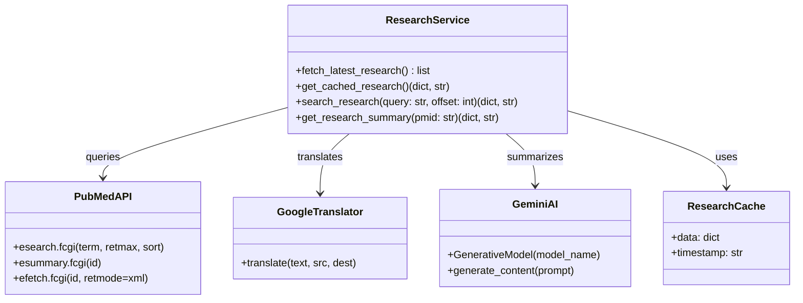
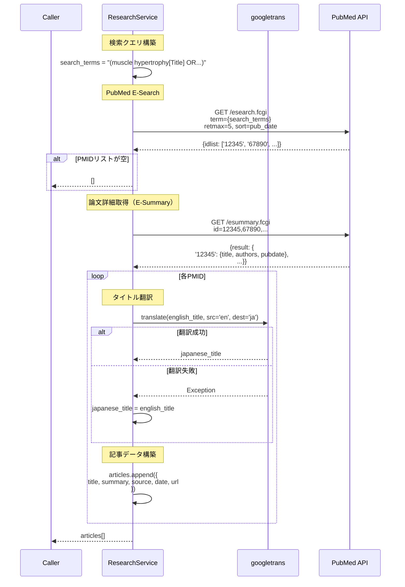
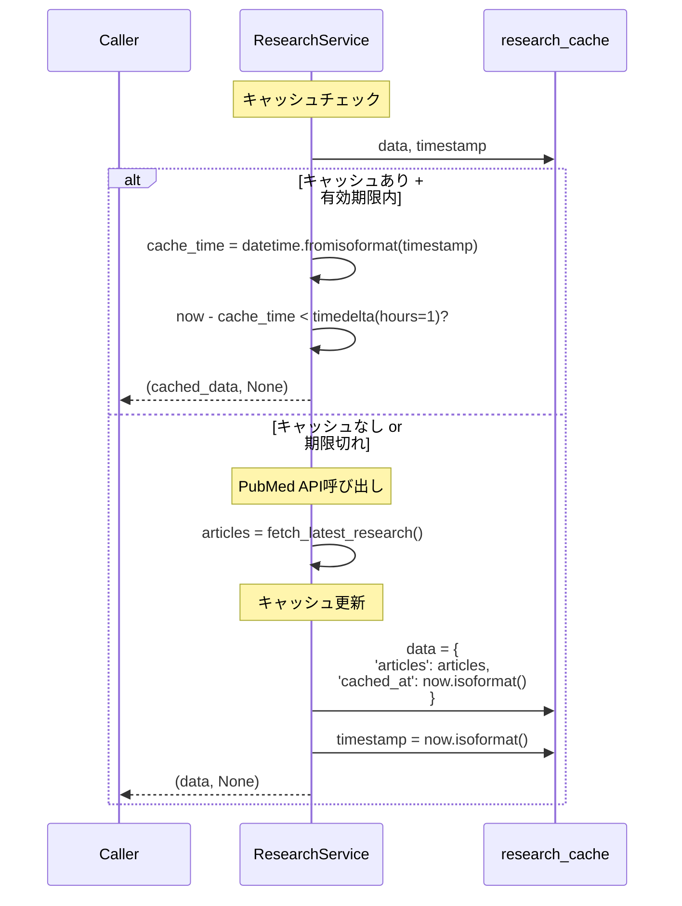
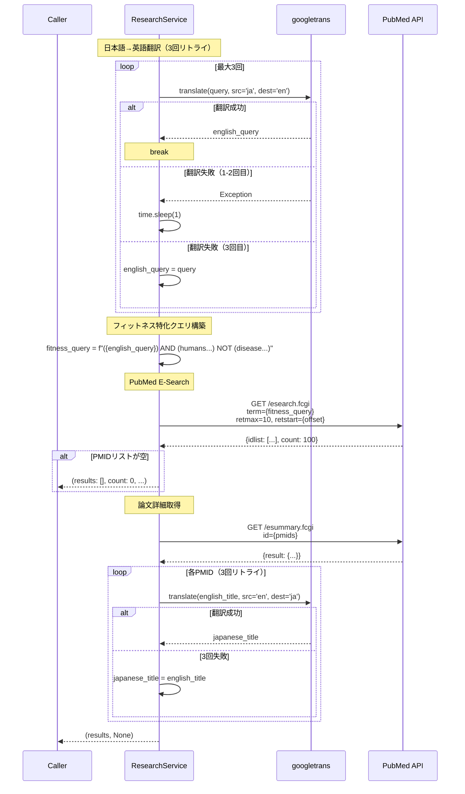
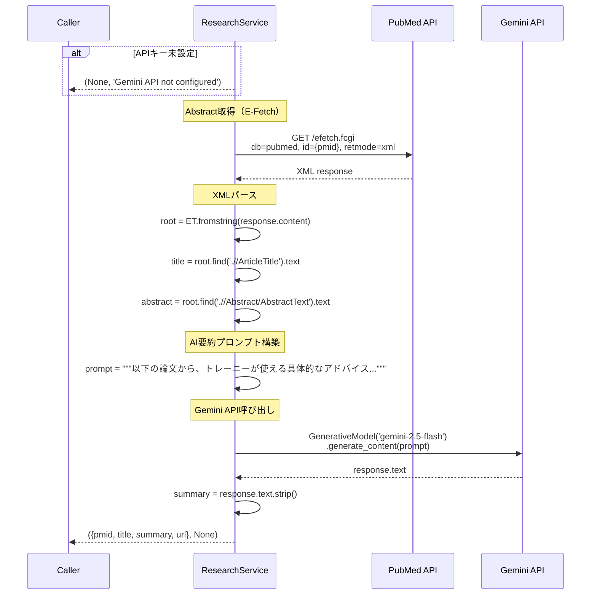
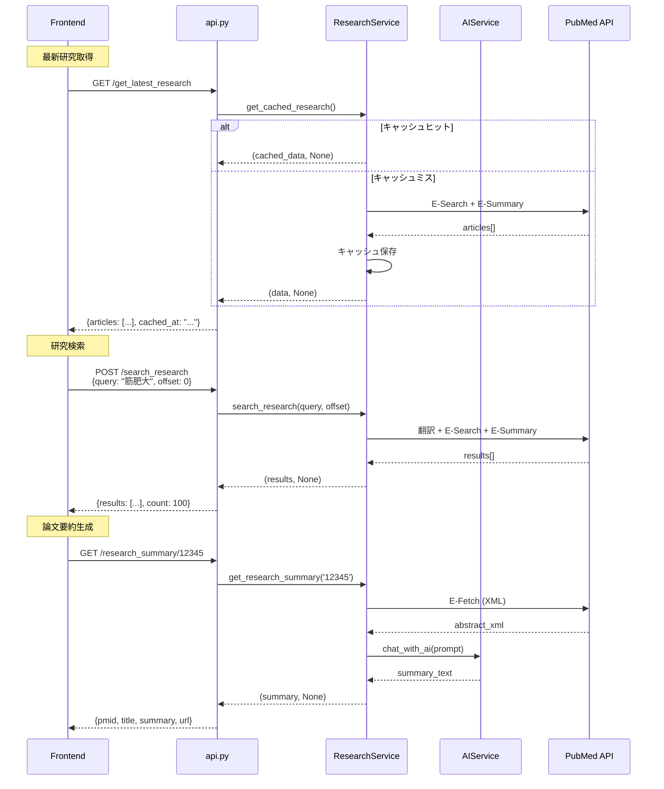
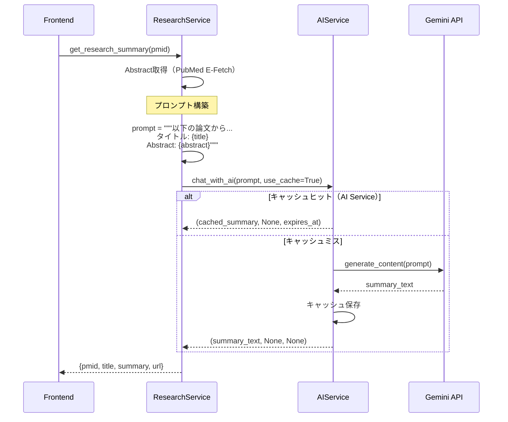

# 詳細設計書: ResearchService（PubMed検索・翻訳・AI要約サービス）

**作成日**: 2026年1月4日  
**バージョン**: 1.0  
**担当**: MICHELAバックエンド

---

## 1. 概要

### 1.1 目的
PubMed APIから最新のフィットネス研究論文を検索し、日本語翻訳とAI要約を提供する。

### 1.2 責務
- PubMed E-utilities APIとの連携（E-Search、E-Summary、E-Fetch）
- 日英翻訳（googletrans）
- 研究論文の検索（日本語クエリ → 英語変換 → PubMed検索）
- 最新研究のキャッシュ（1時間TTL）
- AI要約生成（Gemini 2.5 Flash）
- フィットネス特化フィルタリング（人間対象研究のみ）

### 1.3 特徴
- **人間対象限定**: 動物実験・in vitro研究を除外
- **疾患除外**: 病気治療目的の研究を除外
- **3回リトライ**: googletransの不安定性対策
- **1時間キャッシュ**: 最新研究リストのキャッシュ
- **実践的要約**: 学術的な説明ではなく具体的なアドバイス形式

---

## 2. クラス図



---

## 3. データモデル

### 3.1 Article（研究記事）

| フィールド | 型 | 説明 | 例 |
|-----------|-----|------|-----|
| title | string | 日本語タイトル | "筋肥大における..." |
| summary | string | 簡単な要約 | "Smith J.らによる研究" |
| source | string | データソース | "PubMed" |
| date | string | 発行日（ISO 8601） | "2024-01-15" |
| url | string | PubMed URL | "https://pubmed.ncbi.nlm.nih.gov/12345/" |

### 3.2 SearchResult（検索結果）

| フィールド | 型 | 説明 | 例 |
|-----------|-----|------|-----|
| pmid | string | PubMed ID | "12345678" |
| title | string | 日本語タイトル | "レジスタンストレーニングの効果" |
| authors | string | 著者（最大3名） | "Smith J., Doe A., Lee K." |
| date | string | 発行日 | "2024 Jan" |
| url | string | PubMed URL | "https://pubmed.ncbi.nlm.nih.gov/12345678/" |

### 3.3 ResearchSummary（論文要約）

| フィールド | 型 | 説明 | 例 |
|-----------|-----|------|-----|
| pmid | string | PubMed ID | "12345678" |
| title | string | 英語タイトル | "Effects of Resistance Training..." |
| summary | string | AI生成要約（実践的アドバイス形式） | "筋肥大には1日あたり体重1kgあたり1.6gのタンパク質摂取が効果的です..." |
| url | string | PubMed URL | "https://pubmed.ncbi.nlm.nih.gov/12345678/" |

### 3.4 ResearchCache（キャッシュ）

```python
research_cache = {
    'data': {
        'articles': [Article, Article, ...],  # 最大5件
        'cached_at': '2026-01-04T10:30:00'    # キャッシュ日時
    },
    'timestamp': '2026-01-04T10:30:00'        # キャッシュ開始時刻
}
```

**TTL**: 1時間（`timedelta(hours=1)`）

---

## 4. メソッド仕様

### 4.1 fetch_latest_research() → list[Article]

**目的**: PubMed APIから最新の筋トレ・ダイエット研究を5件取得

**入力パラメータ**: なし

**返り値**: `list[Article]` - 研究記事リスト（最大5件）

**処理フロー**:


**検索クエリ**:
```python
search_terms = """
(((muscle hypertrophy[Title] OR resistance training[Title] OR strength training[Title]) 
  OR (weight loss[Title] OR protein intake[Title])) 
 AND (humans[MeSH Terms] OR human[Title/Abstract] OR adults[Title/Abstract]) 
 AND (training[Title/Abstract] OR exercise[Title/Abstract]) 
 AND (2024[PDAT] OR 2025[PDAT]))
NOT (disease[Title] OR cancer[Title] OR ... OR animal[Title] OR in vitro[Title] OR review[Publication Type])
"""
```

**除外キーワード**:
- 疾患: disease, cancer, diabetes, hypertension, stroke, injury, rehabilitation, surgery
- 対象外: elderly, aging, children, pediatric, rat, mouse, animal
- 研究手法: in vitro, cell, chemical, toxicity, molecular, pathway, gene
- 論文タイプ: review[Publication Type]

**翻訳処理**:
```python
try:
    translated = translator.translate(english_title, src='en', dest='ja')
    japanese_title = translated.text
except Exception:
    japanese_title = english_title  # 翻訳失敗時は英語のまま
```

**日付整形**:
```python
# dateutil.parserで解析
try:
    from dateutil import parser
    parsed_date = parser.parse(pub_date_raw)
    pub_date = parsed_date.strftime('%Y-%m-%d')
except Exception:
    # 解析失敗時は正規表現で年抽出
    import re
    year_match = re.search(r'20\d{2}', pub_date_raw)
    pub_date = f"{year_match.group()}-01-01" if year_match else "2024-01-01"
```

**エラー処理**:
```python
except Exception as e:
    print(f"PubMed API Error: {str(e)}")
    return []
```

---

### 4.2 get_cached_research() → tuple[dict | None, str | None]

**目的**: キャッシュから最新研究を取得（1時間以内ならキャッシュ利用）

**入力パラメータ**: なし

**返り値**: `tuple[dict | None, str | None]`
- 成功: `(data, None)` - `data = {'articles': [...], 'cached_at': '...'}`
- 失敗: `(None, error_message)`

**処理フロー**:


**キャッシュ構造**:
```python
research_cache = {
    'data': {
        'articles': [
            {
                'title': '筋肥大における...',
                'summary': 'Smith J.らによる研究',
                'source': 'PubMed',
                'date': '2024-01-15',
                'url': 'https://pubmed.ncbi.nlm.nih.gov/12345/'
            },
            ...
        ],
        'cached_at': '2026-01-04T10:30:00'
    },
    'timestamp': '2026-01-04T10:30:00'
}
```

**キャッシュ有効期限**:
```python
if datetime.now() - cache_time < timedelta(hours=1):
    return research_cache['data'], None
```

**空キャッシュ保存**:
```python
# 空でもキャッシュに保存（頻繁なAPI呼び出しを防ぐ）
research_cache['data'] = {
    'articles': articles,  # []の場合もある
    'cached_at': datetime.now().isoformat()
}
```

---

### 4.3 search_research(query: str, offset: int = 0) → tuple[dict | None, str | None]

**目的**: 日本語クエリでPubMed検索（翻訳 → フィルタリング → 検索）

**入力パラメータ**:
- `query` (str): 日本語検索クエリ（例: "筋肥大", "タンパク質"）
- `offset` (int, default=0): ページネーションオフセット

**返り値**: `tuple[dict | None, str | None]`
- 成功: `(result, None)` - `result = {'results': [...], 'translated_query': '...', 'count': 100, 'offset': 0, 'displayed_count': 10}`
- 失敗: `(None, error_message)`

**処理フロー**:


**翻訳リトライ戦略**:
```python
# 日本語→英語翻訳（3回リトライ）
english_query = query  # デフォルト
for attempt in range(3):
    try:
        translator = Translator()
        translated = translator.translate(query, src='ja', dest='en')
        english_query = translated.text
        print(f"[search_research] Translation successful: {query} -> {english_query}")
        break  # 成功したら抜ける
    except Exception as translate_error:
        print(f"[search_research] Translation attempt {attempt + 1} failed: {translate_error}")
        if attempt < 2:
            import time
            time.sleep(1)  # 1秒待ってリトライ
```

**フィットネス特化フィルタ**:
```python
fitness_query = f"""
({english_query}) 
AND (humans[MeSH Terms] OR human OR adults) 
AND (resistance training OR strength training OR exercise OR training OR nutrition OR diet) 
NOT (disease OR pathology OR clinical trial OR patient OR therapy OR treatment OR cancer OR diabetes 
     OR heart failure OR hypertension OR cardiovascular OR stroke OR injury OR rehabilitation OR surgery 
     OR medical OR hospital OR elderly OR aging OR chronic OR acute OR syndrome OR disorder 
     OR impairment OR disability OR risk OR mortality OR morbidity OR rat OR mouse OR mice OR animal 
     OR in vitro OR in vivo OR cell culture OR chemical OR compound OR toxicity OR contamination 
     OR pollutant OR pesticide OR hormone disruption OR molecular OR mechanism OR pathway OR gene 
     OR protein expression OR enzyme OR receptor OR signaling OR review[Publication Type] OR meta-analysis[Publication Type])
"""
```

**返り値構造**:
```python
return {
    'results': [
        {
            'pmid': '12345678',
            'title': 'レジスタンストレーニングの効果',
            'authors': 'Smith J., Doe A., Lee K.',
            'date': '2024 Jan',
            'url': 'https://pubmed.ncbi.nlm.nih.gov/12345678/'
        },
        ...
    ],
    'translated_query': 'muscle hypertrophy',  # 英訳後のクエリ
    'search_query': '(muscle hypertrophy) AND (humans...) NOT (disease...)',  # PubMed検索クエリ
    'count': 100,              # 全件数
    'offset': 0,               # オフセット
    'displayed_count': 10      # 表示件数
}, None
```

**ページネーション**:
```python
# 2ページ目（11-20件）
result, error = search_research('筋肥大', offset=10)

# 3ページ目（21-30件）
result, error = search_research('筋肥大', offset=20)
```

---

### 4.4 get_research_summary(pmid: str) → tuple[dict | None, str | None]

**目的**: 論文のAbstractからAI要約を生成（実践的アドバイス形式）

**入力パラメータ**:
- `pmid` (str): PubMed ID

**返り値**: `tuple[dict | None, str | None]`
- 成功: `(summary, None)` - `summary = {'pmid': '...', 'title': '...', 'summary': '...', 'url': '...'}`
- 失敗: `(None, error_message)`

**処理フロー**:


**AIプロンプト**:
```python
prompt = f"""以下の論文から、トレーニーやダイエット実践者が使える具体的なアドバイスを抽出してください（200文字程度）：

タイトル: {title}

Abstract: {abstract}

【重要】以下の形式で回答してください：
- 具体的な数値（タンパク質量、重量、回数、頻度、期間など）
- すぐに実践できる推奨事項
- 「研究によると〜」ではなく「〜がおすすめです」「〜が効果的です」という断定形で
- 学術的な説明ではなく、実践的なアドバイスとして

例：「筋肥大には1日あたり体重1kgあたり1.6gのタンパク質摂取が効果的です」
「10RM（10回で限界になる重量）でのトレーニングが筋肥大に最も効果的です」"""
```

**XMLパース例**:
```python
root = ET.fromstring(fetch_response.content)

# タイトル取得
title_elem = root.find('.//ArticleTitle')
title = title_elem.text if title_elem is not None else 'No title'

# Abstract取得
abstract_elem = root.find('.//Abstract/AbstractText')
abstract = abstract_elem.text if abstract_elem is not None else 'No abstract available'
```

**APIキーチェック**:
```python
if not GEMINI_API_KEY:
    return None, 'Gemini API not configured'
```

**エラーハンドリング**:
```python
try:
    # ... 処理 ...
    return summary_dict, None
except Exception as e:
    return None, str(e)
```

---

## 5. 使用例

### 5.1 最新研究の取得（キャッシュ利用）
```python
from app.services import research_service

# 1回目: PubMed APIから取得
data, error = research_service.get_cached_research()

if not error:
    for article in data['articles']:
        print(f"タイトル: {article['title']}")
        print(f"日付: {article['date']}")
        print(f"URL: {article['url']}")
        print()

# 2回目: キャッシュヒット（1時間以内）
data2, error2 = research_service.get_cached_research()
# fetch_latest_research()は呼ばれない
```

**出力例**:
```
タイトル: 筋肥大における高タンパク質食の効果
日付: 2024-12-15
URL: https://pubmed.ncbi.nlm.nih.gov/12345678/

タイトル: レジスタンストレーニングと有酸素運動の比較
日付: 2024-11-20
URL: https://pubmed.ncbi.nlm.nih.gov/87654321/
```

### 5.2 研究検索（日本語クエリ）
```python
# 1ページ目（1-10件）
result, error = research_service.search_research('筋肥大 タンパク質', offset=0)

if not error:
    print(f"検索クエリ（英語）: {result['translated_query']}")
    print(f"全件数: {result['count']}件")
    print(f"表示件数: {result['displayed_count']}件\n")
    
    for paper in result['results']:
        print(f"PMID: {paper['pmid']}")
        print(f"タイトル: {paper['title']}")
        print(f"著者: {paper['authors']}")
        print(f"日付: {paper['date']}")
        print()

# 2ページ目（11-20件）
result2, error2 = research_service.search_research('筋肥大 タンパク質', offset=10)
```

**出力例**:
```
[search_research] Starting search for query: 筋肥大 タンパク質, offset: 0
[search_research] Translation successful: 筋肥大 タンパク質 -> muscle hypertrophy protein
[search_research] Querying PubMed with: (muscle hypertrophy protein) AND (humans...
[search_research] Found 156 articles

検索クエリ（英語）: muscle hypertrophy protein
全件数: 156件
表示件数: 10件

PMID: 39012345
タイトル: 高タンパク質食と筋肥大の関係
著者: Smith J., Lee K., Tanaka H.
日付: 2024 Dec
```

### 5.3 論文要約（AI生成）
```python
# PMID指定で要約取得
summary, error = research_service.get_research_summary('39012345')

if not error:
    print(f"PMID: {summary['pmid']}")
    print(f"タイトル: {summary['title']}")
    print(f"\n【実践的アドバイス】")
    print(summary['summary'])
    print(f"\n詳細: {summary['url']}")
```

**出力例**:
```
PMID: 39012345
タイトル: Effects of High Protein Intake on Muscle Hypertrophy

【実践的アドバイス】
筋肥大を目指す場合、1日あたり体重1kgあたり1.6gのタンパク質摂取が効果的です。
この量を3-4回の食事に分けて摂取することで、筋タンパク質合成が最大化されます。
トレーニング直後30分以内に20-25gのタンパク質を摂取すると、さらに効果が高まります。
プロテインサプリメントも有効ですが、食事からの摂取を優先しましょう。

詳細: https://pubmed.ncbi.nlm.nih.gov/39012345/
```

### 5.4 API連携（Flask）
```python
@app.route('/get_latest_research', methods=['GET'])
def get_latest_research():
    """最新研究取得エンドポイント"""
    data, error = research_service.get_cached_research()
    if error:
        return jsonify({'error': error}), 500
    return jsonify(data), 200


@app.route('/search_research', methods=['POST'])
def search_research_endpoint():
    """研究検索エンドポイント"""
    data = request.json
    if not data or 'query' not in data:
        return jsonify({'error': 'Query is required'}), 400
    
    offset = data.get('offset', 0)
    result, error = research_service.search_research(data['query'], offset)
    
    if error:
        return jsonify({'error': error}), 500
    
    return jsonify(result), 200


@app.route('/research_summary/<pmid>', methods=['GET'])
def research_summary_endpoint(pmid):
    """論文要約エンドポイント"""
    summary, error = research_service.get_research_summary(pmid)
    
    if error:
        return jsonify({'error': error}), 500
    
    return jsonify(summary), 200
```

---

## 6. エラーハンドリング戦略

### 6.1 googletrans翻訳エラー
**状況**: googletransが不安定（レート制限、ネットワークエラー等）

**対策**: 3回リトライ + 1秒待機
```python
for attempt in range(3):
    try:
        translator = Translator()
        translated = translator.translate(query, src='ja', dest='en')
        english_query = translated.text
        break  # 成功
    except Exception as e:
        print(f"Translation attempt {attempt + 1} failed: {e}")
        if attempt < 2:
            time.sleep(1)  # 1秒待機
        else:
            # 3回失敗: 元のクエリをそのまま使用
            english_query = query
```

**フォールバック**: 翻訳失敗時は元のクエリをそのまま使用

### 6.2 PubMed APIエラー
**状況**: APIレスポンスが空、タイムアウト、無効なJSON

**対策**:
```python
try:
    response = requests.get(url, params=params, timeout=10)
    data = response.json()
    
    # レスポンス検証
    if 'esearchresult' not in data or 'idlist' not in data:
        return []  # 空リスト返却
except requests.exceptions.Timeout:
    print("PubMed API timeout")
    return []
except Exception as e:
    print(f"PubMed API Error: {str(e)}")
    return []
```

### 6.3 Gemini APIエラー
**状況**: API呼び出し失敗、レート制限、無効なレスポンス

**対策**:
```python
if not GEMINI_API_KEY:
    return None, 'Gemini API not configured'

try:
    model = genai.GenerativeModel('gemini-2.5-flash')
    response = model.generate_content(prompt)
    return {'pmid': pmid, 'summary': response.text.strip(), ...}, None
except Exception as e:
    return None, str(e)
```

### 6.4 XMLパースエラー
**状況**: PubMed E-Fetch APIのXMLレスポンスが不正

**対策**:
```python
try:
    root = ET.fromstring(fetch_response.content)
    
    # 安全な要素取得（存在しない場合はデフォルト値）
    title_elem = root.find('.//ArticleTitle')
    title = title_elem.text if title_elem is not None else 'No title'
    
    abstract_elem = root.find('.//Abstract/AbstractText')
    abstract = abstract_elem.text if abstract_elem is not None else 'No abstract available'
except ET.ParseError as e:
    return None, f"XML parse error: {str(e)}"
```

---

## 7. パフォーマンス考慮事項

### 7.1 キャッシュ効率

**現在のキャッシュ戦略**:
- 最新研究リスト: 1時間TTL
- AI要約: キャッシュなし（毎回生成）

**推奨改善**:
```python
# AI要約もキャッシュ（ai_serviceのキャッシュ機能を利用）
from app.services import ai_service

def get_research_summary(pmid):
    # ... Abstract取得 ...
    
    # AI呼び出し（キャッシュ利用）
    summary, error, cached_until = ai_service.chat_with_ai(prompt, use_cache=True)
    
    if error:
        return None, error
    
    return {
        'pmid': pmid,
        'title': title,
        'summary': summary,
        'url': f"https://pubmed.ncbi.nlm.nih.gov/{pmid}/",
        'cached': cached_until is not None
    }, None
```

### 7.2 PubMed APIレート制限

**NCBI E-utilities制限**:
- APIキーなし: 3リクエスト/秒
- APIキーあり: 10リクエスト/秒

**現状**: APIキー未使用（制限: 3req/s）

**推奨対応**:
```python
# .envに追加
PUBMED_API_KEY = "your_ncbi_api_key"

# リクエストに追加
search_params = {
    'db': 'pubmed',
    'term': search_terms,
    'api_key': os.environ.get('PUBMED_API_KEY', ''),  # 追加
    'retmax': 5,
    'sort': 'pub_date',
    'retmode': 'json'
}
```

### 7.3 googletransのパフォーマンス

**現状の問題**:
- 各タイトルで個別に翻訳API呼び出し（5件 × 3回リトライ = 最大15回）
- 遅い（1回あたり0.5-2秒）

**推奨改善**: バッチ翻訳
```python
def batch_translate(texts, src='en', dest='ja'):
    """複数テキストを一括翻訳"""
    translator = Translator()
    
    try:
        # 改行区切りで結合
        combined_text = '\n'.join(texts)
        translated = translator.translate(combined_text, src=src, dest=dest)
        
        # 分割して返す
        return translated.text.split('\n')
    except Exception:
        # フォールバック: 個別翻訳
        return [translate_single(text, src, dest) for text in texts]
```

---

## 8. セキュリティ考慮事項

### 8.1 外部API依存
**リスク**: PubMed APIダウン、googletrans不安定

**対策**:
- タイムアウト設定（10秒）
- エラー時は空リスト返却（サービス継続）
- ユーザーへのエラーメッセージ表示

### 8.2 APIキー保護
**現状**: 環境変数から読み込み

**推奨**:
```python
# Google Secret Managerから取得
from google.cloud import secretmanager

def get_secret(secret_id):
    client = secretmanager.SecretManagerServiceClient()
    name = f"projects/{PROJECT_ID}/secrets/{secret_id}/versions/latest"
    response = client.access_secret_version(request={"name": name})
    return response.payload.data.decode("UTF-8")

GEMINI_API_KEY = get_secret('gemini-api-key')
```

### 8.3 入力サニタイゼーション
**リスク**: SQLインジェクション的なPubMed検索クエリ

**対策**:
```python
def sanitize_query(query):
    """検索クエリをサニタイズ"""
    # 特殊文字エスケープ
    forbidden_chars = ['[', ']', '(', ')', '"', "'"]
    
    for char in forbidden_chars:
        query = query.replace(char, '')
    
    # 長さ制限
    return query[:200]

# 使用時
sanitized = sanitize_query(user_input)
result, error = search_research(sanitized, offset)
```

---

## 9. テスト戦略

### 9.1 単体テスト（実装済み）

| テストケース | 内容 | カバレッジ |
|-------------|------|-----------|
| `test_fetch_latest_research_success` | PubMed API成功ケース | ○ |
| `test_fetch_latest_research_no_results` | 検索結果なし | ○ |
| `test_fetch_latest_research_error` | ネットワークエラー | ○ |
| `test_get_cached_research_cache_hit` | キャッシュヒット | ○ |
| `test_get_cached_research_cache_miss` | キャッシュミス | ○ |
| `test_search_research_success` | 検索成功 | ○ |
| `test_get_research_summary_success` | AI要約生成成功 | ○ |
| `test_get_research_summary_no_api_key` | APIキー未設定 | ○ |
| `test_fetch_latest_research_translation_error` | 翻訳エラー | ○ |
| `test_fetch_latest_research_invalid_response` | 無効なレスポンス | ○ |
| `test_search_research_translation_retry` | 翻訳リトライ | ○ |
| `test_get_research_summary_error_handling` | AI要約エラー | ○ |
| `test_search_research_error_handling` | 検索エラー | ○ |
| `test_get_cached_research_error_handling` | キャッシュエラー | ○ |

**カバレッジ**: 80%（Branch Coverage）

**未カバー箇所**:
- googletransのリトライループ詳細
- dateutil.parserの例外処理
- 一部のログ出力行

### 9.2 推奨追加テスト

```python
def test_search_research_pagination():
    """ページネーションのテスト"""
    # 1ページ目
    result1, _ = research_service.search_research('筋肥大', offset=0)
    
    # 2ページ目
    result2, _ = research_service.search_research('筋肥大', offset=10)
    
    # PMIDが重複しないことを確認
    pmids1 = [r['pmid'] for r in result1['results']]
    pmids2 = [r['pmid'] for r in result2['results']]
    
    assert len(set(pmids1) & set(pmids2)) == 0

def test_fetch_latest_research_date_parsing():
    """日付解析のテスト"""
    # 様々な日付形式をテスト
    test_dates = [
        '2024-01-15',
        '2024 Jan 15',
        'Jan 2024',
        '2024'
    ]
    
    for pub_date_raw in test_dates:
        # ... 日付解析ロジックをテスト ...
        assert parsed_date is not None

def test_get_research_summary_with_cache():
    """AI要約のキャッシュ動作テスト"""
    pmid = '12345'
    
    # 1回目: AI呼び出し
    summary1, _ = research_service.get_research_summary(pmid)
    
    # 2回目: キャッシュヒット（ai_serviceのキャッシュ利用）
    summary2, _ = research_service.get_research_summary(pmid)
    
    assert summary1 == summary2
```

### 9.3 統合テスト（推奨）

```python
def test_end_to_end_research_flow():
    """研究検索→要約生成のE2Eテスト"""
    # 1. 最新研究取得
    data, error = research_service.get_cached_research()
    assert error is None
    assert len(data['articles']) > 0
    
    # 2. 日本語検索
    result, error = research_service.search_research('タンパク質')
    assert error is None
    assert len(result['results']) > 0
    
    # 3. 論文要約生成
    pmid = result['results'][0]['pmid']
    summary, error = research_service.get_research_summary(pmid)
    assert error is None
    assert len(summary['summary']) > 50
```

---

## 10. 統合ポイント

### 10.1 API層（Flask）



**api.py実装例**:
```python
@app.route('/get_latest_research', methods=['GET'])
def get_latest_research():
    """最新の筋トレ・ダイエット研究記事を取得（キャッシュ利用）"""
    try:
        data, error = research_service.get_cached_research()
        if error:
            return jsonify({'error': error}), 500
        return jsonify(data), 200
    except Exception as e:
        return jsonify({'error': str(e)}), 500


@app.route('/search_research', methods=['POST'])
def search_research():
    """研究検索（日本語→英語翻訳→PubMed検索）"""
    data = request.json
    if not data or 'query' not in data:
        return jsonify({'error': 'Query is required'}), 400
    
    offset = data.get('offset', 0)
    result, error = research_service.search_research(data['query'], offset)
    
    if error:
        return jsonify({'error': error}), 500
    
    return jsonify(result), 200


@app.route('/research_summary/<pmid>', methods=['GET'])
def research_summary(pmid):
    """論文の要約をAI生成"""
    summary, error = research_service.get_research_summary(pmid)
    
    if error:
        return jsonify({'error': error}), 500
    
    return jsonify(summary), 200
```

### 10.2 AI Service連携



**research_service.py実装**:
```python
from app.services import ai_service

def get_research_summary(pmid):
    """論文の要約をAI生成（ai_serviceのキャッシュ利用）"""
    if not GEMINI_API_KEY:
        return None, 'Gemini API not configured'
    
    try:
        # Abstract取得
        abstract = fetch_abstract_from_pubmed(pmid)
        
        # AIプロンプト構築
        prompt = f"""以下の論文から、トレーニーが使える具体的なアドバイスを抽出（200文字程度）：
        
タイトル: {title}
Abstract: {abstract}

【重要】
- 具体的な数値（タンパク質量、重量、回数、頻度）
- すぐに実践できる推奨事項
- 断定形で（"〜がおすすめです"）"""
        
        # AI呼び出し（キャッシュ利用）
        summary, error, cached_until = ai_service.chat_with_ai(prompt, use_cache=True)
        
        if error:
            return None, error
        
        return {
            'pmid': pmid,
            'title': title,
            'summary': summary,
            'url': f"https://pubmed.ncbi.nlm.nih.gov/{pmid}/",
            'cached': cached_until is not None
        }, None
        
    except Exception as e:
        return None, str(e)
```

---

## 11. 変更履歴

| 日付 | バージョン | 変更内容 | 担当 |
|------|-----------|---------|------|
| 2026-01-04 | 1.0 | 初版作成（PubMed API + googletrans + Gemini AI） | System |

---

## 12. 関連ドキュメント

- [AI Service設計書](06_ai_service_design.md)（要約生成連携）
- [api.py設計書](../api/endpoints.md)（/get_latest_research等）
- [PubMed E-utilities公式ドキュメント](https://www.ncbi.nlm.nih.gov/books/NBK25501/)
- [googletrans公式ドキュメント](https://py-googletrans.readthedocs.io/)
- [Gemini API公式ドキュメント](https://ai.google.dev/gemini-api/docs)
- [キャッシュ戦略ガイドライン](../performance/cache_optimization.md)（推奨）
